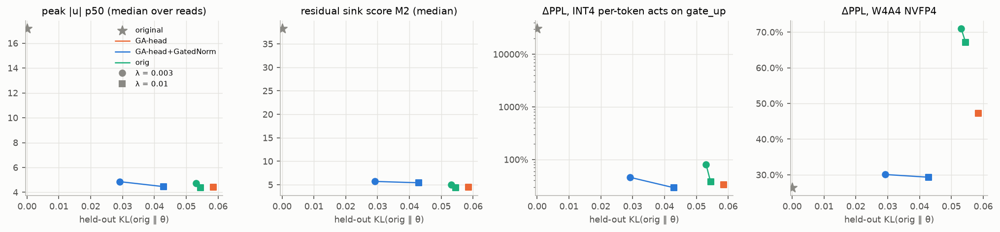
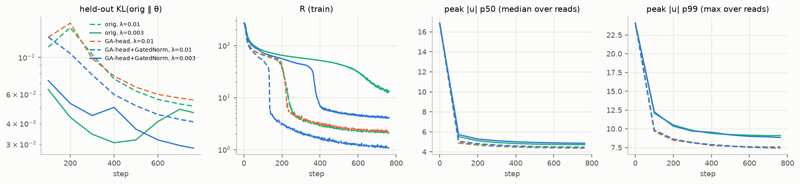

# OutliersInLLM: retrofitting GatedNorm and Gated Attention into a pretrained LLM

Can you take an already-trained LLM, bolt on the gating mechanisms that make outliers unnecessary, and fine-tune the outliers away more cheaply than you could without them?

This repository measures the activation outliers of two small Qwen models and then tries exactly that. We add **identity-initialized GatedNorm** ([Qiu et al., 2026](https://arxiv.org/abs/2601.22966)) and **identity-initialized Gated Attention (GA)** to a pretrained model. Then we fine-tune with a KL-distillation loss plus an outlier penalty, and compare against the same fine-tune on the unmodified architecture.

**Headline result on Qwen3-0.6B-Base.** The GA + GatedNorm retrofit removes the model's 7200-magnitude massive activation. For the same regularization, it does so at **about half the KL cost** of the original architecture. Zero-shot accuracy is unchanged, and the model is far more robust to W4A16, W4A4 and INT4-activation quantization than the plain fine-tune.

---

## Key result: Qwen3-0.6B-Base

All runs use the same objective, data (200M tokens of FineWeb-Edu) and schedule. λ is the strength of the outlier penalty.

| Model | λ | KL to original ↓ | WikiText-2 PPL ↓ | Zero-shot avg ↑ | First-token massive activation | Attention-sink ratio | W4A16 ΔPPL | W4A4 (NVFP4) ΔPPL | INT4-act ΔPPL |
|---|---|---|---|---|---|---|---|---|---|
| Original | – | 0 | 12.67 | 0.554 | 7200 | 0.75 | +46% | +26% | +95,015% |
| Fine-tune, original architecture | 3e-3 | 0.053 | 13.63 | 0.551 | 1696 | 0.58 | +125% | +71% | +30,377% |
| **Fine-tune + GA + GatedNorm** | 3e-3 | **0.029** | **13.22** | **0.558** | **248** | 0.54 | **+43%** | **+30%** | **+4,020%** |
| Fine-tune, original architecture | 1e-2 | 0.055 | 13.75 | 0.545 | 164 | 0.48 | +91% | +67% | +12,765% |
| Fine-tune + GA only | 1e-2 | 0.059 | 13.78 | 0.543 | 280 | 0.19 | +61% | +47% | +7,275% |
| **Fine-tune + GA + GatedNorm** | 1e-2 | **0.043** | **13.51** | **0.552** | 223 | 0.36 | **+39%** | **+29%** | **+2,594%** |

Notes on the columns:
- **KL**: held-out KL(original ‖ fine-tuned).
- **Zero-shot avg**: lm-eval over ARC-e/c, HellaSwag, PIQA, WinoGrande and LAMBADA.
- **Quantization columns**: round-to-nearest fake quantization. ΔPPL is measured relative to each model's own bf16 PPL.
- **INT4-act**: per-token INT4 activations on every Linear.



## What we found

### 1. Qwen3's outliers are machinery, not noise

On the original model:
- **A massive activation (MA) builds the attention sink.** The layer-2 MLP writes a massive activation of ~7200 into hidden dim 35 of the first token. It does this through a single "super weight", `W_down[35, 55]`, which is 24σ. The layer-27 MLP cancels the MA again. This one-hot first token is what makes 75% of attention heads dump their attention on it (the attention sink).
- **The same dim is also a residual sink for every other token.** Dim 35 carries a residual sink that the MLP-input RMSNorm hides with a weight of λ ≈ 3·10⁻⁵.
- **The MA is also the cause of the catastrophic INT4 collapse.** Quantizing *only the first token's* input to the layer-2 MLP to INT4 raises perplexity by +495% and shrinks the MA from 7200 to 94. What breaks under quantization is the machinery that produces the outlier, not the outlier's magnitude.

### 2. Removing the outliers without a replacement path makes the model fragile

A strong penalty on the first token (weighted ×256) eventually makes even the original architecture give up its MA, at 200M tokens. However, its attention weights become 2–5× more sensitive to 4-bit weight quantization:

| W4A16, one module type quantized at a time | Original | Fine-tune (orig. arch.) | Fine-tune + GA + GatedNorm |
|---|---|---|---|
| q/k/v projections | +10.2% | +26.6 to +28.1% | **+7.0 to +8.6%** |
| o_proj | +2.3% | +8.2 to +11.1% | +3.4 to +3.8% |

The weight statistics themselves barely change. Our interpretation is that, without a gate, the model rebuilds its "do nothing" behaviour out of finely balanced q·k products. With GA, the gate does that job, and the attention weights end up *more* robust than in the original model.

### 3. With gates, the model switches from the sink to gating, like a phase transition



- **The switch is abrupt.** The outlier penalty R drops by an order of magnitude at one point in training. That is when the model abandons the MA and the attention sink.
- **The gated model switches earliest.** With GA + GatedNorm this happens at step ~130 (λ = 1e-2). The original architecture needs step ~220 at λ = 1e-2, and does not finish within 200M tokens at λ = 3e-3.
- **KL recovers after the switch.** For example, it goes from 0.13 to 0.043.
- **The switch has a threshold.** With a weak penalty (λ = 1e-3), even the GA model keeps its sink. The zero-initialized gates only receive gradient once the penalty actually starts breaking the MA.

After the switch, both gates carry real function. Resetting GatedNorm to 1 raises KL to 0.53–0.88, and resetting GA raises it to 0.37–0.54. GatedNorm also learns the pattern reported by Qiu et al.: dimensions with larger |y| get smaller gates (correlation −0.42 to −0.50).

### 4. GA alone is not enough

GA alone removes the attention sink most completely (ratio 0.19). But it is worse than GA + GatedNorm on KL, zero-shot accuracy and every quantization metric (for example, W4A16 +61% vs +39%).

### 5. Outliers move to wherever you are not looking (limitations)

We penalize the input and output of every residual RMSNorm. The outliers then reappear in the MLP intermediate activations (`down_proj` inputs) of the last few layers:
- channel-RMS ratio: up to 187
- kurtosis: up to ~1750
- last-layer first-token activation: 1440 → 5216

This is why W4A4 NVFP4 (+29–30%) is still slightly worse than the original model (+26%). Extending the penalty to the MLP intermediates is the obvious next step.

## Also tested: Qwen3.5-0.8B-Base (hybrid Gated DeltaNet + Gated Attention)

Qwen3.5 already has output-gated attention, and it shows **no massive activations and no attention sink**. It still has a strong, input-independent residual sink in dim 0. That sink is *not* hidden by the RMSNorm weight (λ ≈ 1), so it leaks straight into the q/k/v and gate/up inputs.

Removing it is cheap even without any retrofit: +0.3–1.1% PPL and ±0.2 points zero-shot. Retrofitting GatedNorm lowers the KL cost by 20–40%, and a zero-initialized bias gives no benefit. So the gating retrofit pays off most where outliers actually implement rescaling, as in Qwen3.

Two pitfalls showed up along the way:
- A lenient threshold (τ = 8) just moves the sink to another dimension, just under the threshold.
- Penalizing only the norm *input* lets GatedNorm rebuild the sink with its gate. This looks great on the loss but makes the quantized activations worse. We therefore penalize both the input and the output of each norm.

## Method

- **Identity-initialized retrofits**: at initialization the model's logits are bit-identical to the original's (unit-tested).
  - **GatedNorm**: `y' = y ⊙ 2σ(W_up · SiLU(W_down · y))` with rank 16 and `W_up = 0`, wrapped around each residual RMSNorm (49 of them for Qwen3.5, 57 for Qwen3).
  - **Gated Attention (head-wise)**: `attn_out ⊙ 2σ(W_g · x̂ + b)`, applied at the `o_proj` input, with `W_g = 0` and `b = 0`.
- **Objective**: `KL(p_orig ‖ p_θ) + λ·R`, where the teacher is the frozen original model.
  - `R` is the mean over residual norms, and over both each norm's input and output, of `Σ_j ReLU(|u_j| − τ)²`, with `u = x / rms(x)` and τ = 4.
  - For Qwen3, the first token's term is weighted ×256. A plain token mean dilutes a first-token outlier by 1/T.
- **Training**:
  - Data: 200M tokens of FineWeb-Edu, 762 steps × 128 × 2048.
  - Optimizer: AdamW. Original weights use LR 2e-5; new parameters use LR 1e-3.
  - Precision and memory: fp32 master weights with bf16 autocast, plus gradient checkpointing.
  - Loss computation: a fused chunked lm_head KL, so the full-vocabulary logits are never materialized.
  - Cost: about 5.5 h per run on one RTX 5090.
- **Evaluation**:
  - Quality: WikiText-2 PPL, held-out KL, and lm-eval zero-shot.
  - Outlier metrics: massive activations, residual-sink score, per-token peak of `x/rms(x)`, per-Linear-input channel statistics, and attention-sink ratio.
  - Quantization: RTN fake quantization (INT8, INT4 g128, FP8, and NVFP4 with block 16).

## Caveats

- **Scale**: single seed, 200M fine-tuning tokens, and 0.6B/0.8B models.
- **Quantization**: RTN fake quantization only. No GPTQ, SmoothQuant or rotation-based PTQ has been applied yet.
- **Zero-shot**: ARC-Easy rises by 5–7 points in *every* fine-tuned run, which is likely an effect of the FineWeb-Edu data. On the other five tasks every run is slightly below the original. GA + GatedNorm (λ = 3e-3) loses the least: −0.7 points, vs −1.6 for the original architecture.
- **Latency**: our retrofit is implemented with unfused PyTorch hooks. Batch-1 overhead is +7.6% for prefill and +34% for decode with GA + GatedNorm, mostly from kernel launches.

## Repository layout

```
src/outliers/          library
  models.py            model loading (Qwen3.5 text-only), module-kind mapping, residual norms
  hooks.py, stats.py   forward-hook probes and streaming outlier statistics
  quant.py             RTN fake quantization (INT8/INT4/FP8/NVFP4), SQNR, model-level patching
  retrofit.py          identity-initialized GatedNorm / attention output gate / zero bias, save & load
  losses.py            fused chunked lm_head KL / CE, outlier regularizer
  evaluate.py          chunked NLL, PPL / bits-per-byte
scripts/
  phase1_*.py          outlier measurement, ablations, quantization probes, plots
  prepare_fineweb.py   packed training data
  train_retrofit.py    KL + λR fine-tuning with probes (JSONL + wandb)
  eval_retrofit.py     PPL / KL / outliers / attention sink / RTN / lm-eval for a checkpoint
  phase2_*.py          comparison plots, per-module quantization sensitivity
tests/                 identity-at-init, fused loss vs full loss, statistics vs NumPy, GPU integration tests
docs/reports/          full reports with all tables and figures (Japanese)
docs/plans/            experiment plans, including every mid-course decision and its reason (Japanese)
```

## Reproducing

This requires one CUDA GPU; we used an RTX 5090 (32 GB). The environment is managed with [uv](https://github.com/astral-sh/uv).

```bash
uv sync
uv run pytest                                            # unit + GPU integration tests

# data and baseline
uv run python scripts/prepare_fineweb.py --model qwen3-0.6b
uv run python scripts/eval_retrofit.py --base qwen3-0.6b --attention

# the headline pair (λ = 3e-3): original architecture vs GA + GatedNorm
common="--model qwen3-0.6b --tau 4 --reg-site both --first-weight 256 --tokens 200e6 --lam 3e-3"
uv run python scripts/train_retrofit.py $common --run c2/B1-lam3e-3
uv run python scripts/train_retrofit.py $common --run c2/B3h-lam3e-3 --attn-gate headwise --gated-norm
for d in results/phase2/c2/*/; do uv run python scripts/eval_retrofit.py --ckpt $d/final.pt --attention; done

uv run python scripts/phase2_compare.py --pattern "c2/*" --out figs \
  --base-eval results/phase2/base-qwen3-0.6b/eval/summary.json
```

The complete command lists for every experiment are at the end of each report.

## Reports (in Japanese)

- [Phase 1: outlier analysis of Qwen3.5-0.8B-Base and Qwen3-0.6B-Base](docs/reports/phase1-outliers.md)
- [Phase 2, stage C1: GatedNorm / bias retrofit on Qwen3.5](docs/reports/phase2-c1.md)
- [Phase 2 final report: GA + GatedNorm retrofit on Qwen3](docs/reports/phase2-final.md)

## References

- Z. Qiu et al. *A Unified View of Attention and Residual Sinks: Outlier-Driven Rescaling is Essential for Transformer Training.* [arXiv:2601.22966](https://arxiv.org/abs/2601.22966) (GatedNorm).
- Y. Bondarenko, M. Nagel, T. Blankevoort. *Quantizable Transformers: Removing Outliers by Helping Attention Heads Do Nothing.* [arXiv:2306.12929](https://arxiv.org/abs/2306.12929) (Gated Attention, fine-tuning with gates).
- S. Sun et al. *The Spike, the Sparse and the Sink: Anatomy of Massive Activations and Attention Sinks.* [arXiv:2603.05498](https://arxiv.org/abs/2603.05498) (step-up / step-down blocks).

## License

MIT
