# Phase 1 レポート: 学習済み小型 LLM の外れ値評価（Qwen3.5-0.8B-Base / Qwen3-0.6B-Base）

- 作成: 2026-09-23 / 対象計画: [docs/plans/20260923-gatednorm-retrofit-plan.md](../plans/20260923-gatednorm-retrofit-plan.md) §4
- 生データ: `results/phase1/<model>/*.parquet`（git 管理外）、wandb: project `takuma104/OutliersInLLM`, group `phase1`
- 集計表の全体: `scripts/phase1_summary.py` の出力（本文の表はその抜粋）

---

## 0. 要約

- **環境**: fla の GDN カーネルは RTX 5090（sm_120）で動作し、torch 参照実装と数値的に一致（fp32 参照に対する KL 4e-4 で同等）。計測ライブラリ（hook・ストリーミング統計・fake-quant・PPL/BPB）はテスト付きで Phase 2 でも使える。
- **Qwen3-0.6B（全層 Softmax）** は教科書どおりの外れ値構造を持つ。先頭トークンの dim 35 が L2 MLP（step-up、super weight 24σ）で **7200** になり、L27 で打ち消される。attention sink ratio は 0.75。同じ dim 35 が残差シンク（M2 中央値 38）で、MLP 入力の Norm 重みは **λ ≈ 3e-5** で潰されている。アブレーションでも分母の役割が大きく（分母だけの除去で +29%）、**GatedNorm 論文の「外れ値は再スケール因子」の像に一致する**。
- **Qwen3.5-0.8B（Hybrid GDN＋GA）** には **MA も attention sink も無い**（最大 |h| 21、sink ratio 0）。ただし **dim 0 に入力非依存の残差シンクがはっきりある**（M2 中央値 18、M3 p50 中央値 10.6、英語・日本語・コードで同じ次元）。**その Norm 重みは λ ≈ 1 で抑えられておらず**、ch 0 の外れ値として qkv / gate_up の入力にそのまま届く。アブレーションでは、分母の役割は小さく（+6.8%）、直接成分が大きい（+134%）。直接成分はほぼ定数で、**シンクを Norm から完全に除いて定数バイアスに置き換えても、学習なしで +9.5% しか悪化しない**。論文の像（再スケール因子、λ ≪ 1）とは違い、**Linear にバイアスを供給するチャネル**として働いている。
- **量子化**: Qwen3.5 のほうが一貫して強い（W4A16 +24% vs +46%、W4A4 NVFP4 +18% vs +26%）。per-token INT4 活性では両方とも崩壊するが原因が違う。Qwen3 は **step-up ブロックの MLP 入力の先頭トークンだけ**を INT4 にすると崩壊し（+495%、MA が 7200 → 94）、Qwen3.5 は **GDN out_proj 入力の外れ値チャネル**（単独で +218%）が主因。NVFP4（block 16）の活性なら両方 +7〜10% で済む。
- **仮説**: H1a は先頭トークンについて支持（区切りトークンの MA は無し）、H1b は前半のみ支持（λ ≪ 1 は棄却）、H1c は棄却（down_proj は最悪ではない）。
- **G0**: Qwen3.5 の残差シンクは強く存在するが、機構が計画の前提と違い、λ の条件を満たさない。**GatedNorm（乗算ゲート）より Linear バイアスのほうが自然な代替になる可能性が高い**。§4.3 の選択肢のうち、推奨は **案 C（Qwen3.5 で A1 / A2 / A5(バイアス) の縮小版 → Qwen3-0.6B に GA＋GatedNorm を後付けする主実験）**。Phase 2 の着手前に判断を仰ぎたい。


---

## 1. セットアップ

| 項目 | 内容 |
|---|---|
| モデル | Qwen/Qwen3.5-0.8B-Base（`Qwen3_5ForCausalLM`、テキスト部 0.75B。visual / MTP 重みは読み込まない）、Qwen/Qwen3-0.6B-Base。bf16、sdpa（M7 のみ eager） |
| プローブ | C4 validation shard 0 から、両トークナイザで 2048 token 以上ある文書を 128 本（seed 0）選び、**文書先頭から** 2048 token を切り出す。文書 index は `data/probe_c4_docs.json` |
| LM 評価 | WikiText-2 test（`"\n\n".join` → 2048 token の非重複窓）。PPL と bits-per-byte（BPB: バイト数はバイトレベル BPE のトークン文字列長から厳密に計算） |
| トークン種別 | first = 位置 0、delim = 空白と `.,;:!?` だけから成り `.` か改行を含むトークン、other = それ以外 |
| 計測 | forward hook によるストリーミング統計（`src/outliers/{hooks,stats}.py`）。残差ストリームは各 RMSNorm（input_layernorm / post_attention_layernorm / 最終 norm）の入力として読む |
| fla | `flash-linear-attention` 0.5.2 の GDN カーネルは sm_120（RTX 5090）で動作。torch 参照実装との差は fp32 参照に対する KL で 4.2e-4（fla） vs 4.1e-4（torch）と同等、backward も一致（相対誤差 0.5%）。forward 78K tok/s、grad-ckpt 付き fwd+bwd 19K tok/s（lm_head 抜き、8×2048） |

### 計画からの変更・補足

- **M6 の SQNR / 層出力誤差はトークン平均**（各トークンの雑音/信号比を平均してから dB 化）を主指標にした。全トークンのエネルギー加重だと、MA を持つ少数のトークンが和を支配し（例: Qwen3 L2 down_proj の入力は 3888 の値 1 個で SQNR が 33 dB に見える）、per-token 量子化の難しさを表さないため。加重版は `*_global` 列に残した。
- **M5 の「6σ を超えるチャネル数」**は、262K トークンにわたる absmax を全体 σ と比べると裾の重い入力ではほぼ全チャネルが該当してしまい（down_proj で 3584 中 3540）、情報がない。代わりに **チャネル RMS が中央値の 6 倍を超えるチャネル数**（系統的な外れ値チャネル）を主に用いる。
- Qwen3.5 の `o_proj` 種別は、Full Attention の `o_proj` と GDN の `out_proj` を合わせたもの。性質が大きく違うので、図表では `o_proj (attn)` と `out_proj (GDN)` に分けた。
- M1 の "other" トークンの最大値は、Qwen3 で**位置 1 の 2 トークン**（`"44"`, `"11"` で始まる文書の 2 桁目。1 桁目と同じトークンが続き、先頭トークンのように振る舞う）に支配されていた。図には p99.9 も併記した。

---

## 2. 結果

### 2.1 LM 品質

| model | WikiText-2 PPL | WikiText-2 BPB | C4 probe PPL | C4 probe BPB |
|---|---|---|---|---|
| Qwen3.5-0.8B-Base | 13.12 | 0.8514 | 17.76 | 0.9242 |
| Qwen3-0.6B-Base | 12.67 | 0.8451 | 17.63 | 0.9128 |

WikiText-2 の BPB は 0.851 と 0.845 でほぼ同じ。以下の外れ値の差は「LM としての品質差」によるものではない。

### 2.2 深さ方向プロファイルと massive activation（A, M1, H）

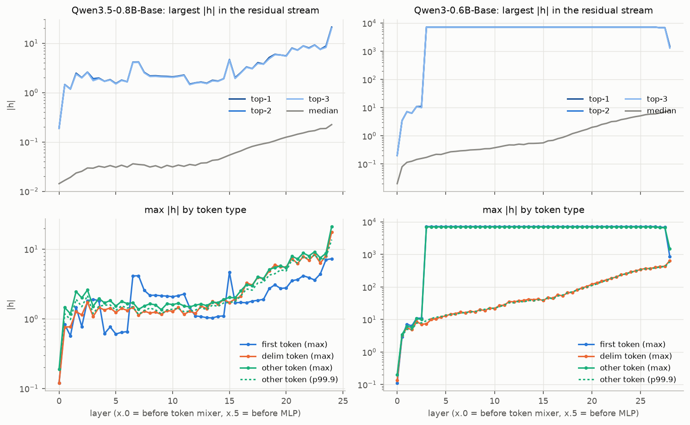
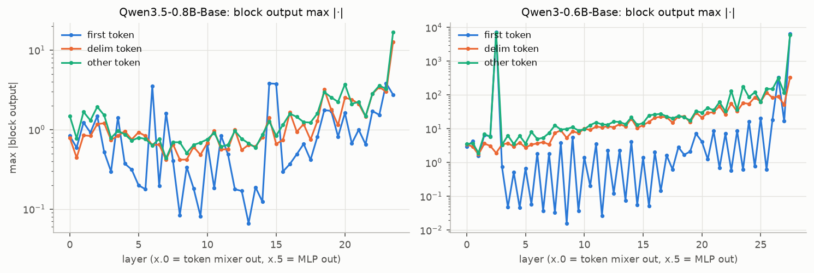

| model | max \|h\| first | max \|h\| delim | max \|h\| other | median \|h\| (mid depth) | top-1 dim | MA tokens first/delim/other | largest first-token block out |
|---|---|---|---|---|---|---|---|
| Qwen3.5-0.8B-Base | 7.28 | 17.5 | 21.1 | 0.0335 | 0 | 0/0/0 | L23.self_attn (3.83) |
| Qwen3-0.6B-Base | 7.2e+03 | 648 | 7.01e+03 | 0.54 | 35 | 128/0/2 | L2.mlp (7.2e+03) |

- **Qwen3-0.6B**: 典型的な MA。先頭トークンの dim 35 が **L2 MLP（step-up）で一気に 7200** になり、L27 MLP（step-down）で打ち消されるまで残差に残る。128 系列すべての先頭トークンが MA の基準（|h|>100 かつ中央値の 1000 倍超）を満たす。step-up の MLP では、down_proj 入力の ch 55 が 3888 に達し、**super weight** W_down[35, 55] = 0.58（行列 std の 24 倍）と、二次形式ノルム ‖U_35‖_F が中央値の 8.2 倍（step-down の L26/L27 でも 6.3 倍 / 17.6 倍）になる（2603.05498 Fig.3 と同じ構図）。区切りトークンの最大値は 10 → 650 と深さとともに増えるが、他のトークンの p99.9 とほぼ重なり、区切りトークンだけが特別に大きいわけではない。
- **Qwen3.5-0.8B**: **MA は無い**。残差の最大値は全層で 21 以下、先頭トークンは 7 以下（MA 基準を満たすトークンは 0）。step-up / step-down ブロックも無い。ただし ‖U_k‖_F の最大は**全 24 層で dim 0**（中央値の 1.9〜3.6 倍）で、MLP が一貫して dim 0 に書き込んでいる。L1 と L3 の down_proj には dim 0 行に super weight 的な要素（std の 21.6 倍、11.6 倍）がある。

‖U_k‖_F 比の上位 4 層（モデルごと）:

| model | layer | uk_top1_dim | uk_top1_over_median | down_in_first_argmax_ch | down_in_first_absmax | super_weight_row | super_weight_over_std |
|---|---|---|---|---|---|---|---|
| Qwen3.5-0.8B-Base | 0 | 0 | 3.61 | 758 | 3.86 | 140 | 4.3 |
| Qwen3.5-0.8B-Base | 1 | 0 | 2.96 | 2 | 1.93 | 0 | 21.6 |
| Qwen3.5-0.8B-Base | 2 | 0 | 3 | 2618 | 2.89 | 487 | 3.45 |
| Qwen3.5-0.8B-Base | 11 | 0 | 2.96 | 162 | 2.16 | 123 | 8.8 |
| Qwen3-0.6B-Base | 2 | 35 | 8.25 | 55 | 3.89e+03 | 35 | 24.1 |
| Qwen3-0.6B-Base | 19 | 35 | 3.14 | 347 | 26.2 | 35 | 8.54 |
| Qwen3-0.6B-Base | 26 | 35 | 6.31 | 1564 | 1.02e+03 | 35 | 10.2 |
| Qwen3-0.6B-Base | 27 | 35 | 17.6 | 2326 | 1.44e+03 | 35 | 18.6 |

### 2.3 残差シンク（B, M2〜M4）

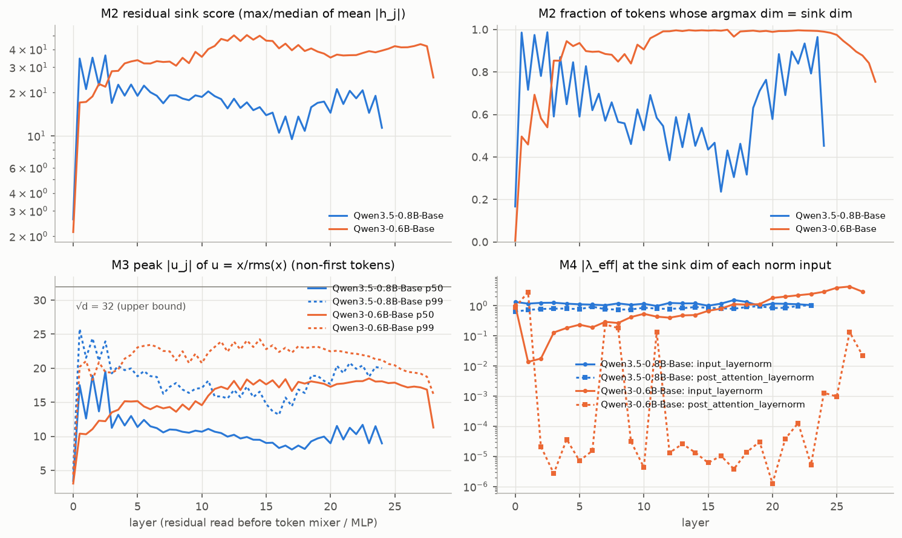
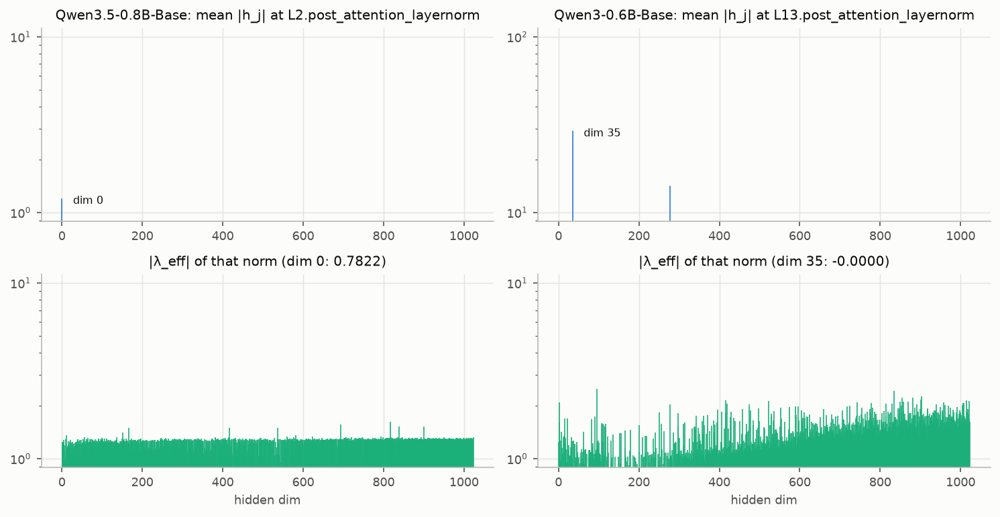
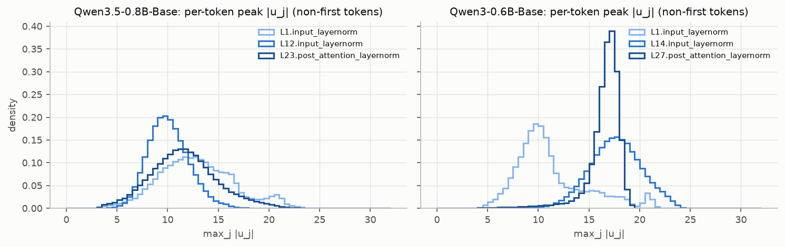

| model | sink dim (#reads) | M2 score median [min–max] | M2 argmax-hit median | #reads M2≥10 | M3 p50 median [max] | M3 p99 median | #reads M3 p50≥10 | e_top4 mean | M4 \|λ\| @sink, attn-norm | M4 \|λ\| @sink, mlp-norm |
|---|---|---|---|---|---|---|---|---|---|---|
| Qwen3.5-0.8B-Base | 0 (46), 347 (1), 4 (1) | 18.2 [2.6–36.3] | 0.611 | 46/48 | 10.6 [19.5] | 18 | 29/48 | 0.255 | 1.18 | 0.816 |
| Qwen3-0.6B-Base | 35 (53), 277 (2), 27 (1) | 38.3 [2.1–50.3] | 0.97 | 55/56 | 17.2 [18.5] | 22.3 | 55/56 | 0.427 | 0.609 | 2.83e-05 |

- **両モデルとも固定次元の残差シンクがはっきりある。** Qwen3 は dim 35（MA と同じ次元）、Qwen3.5 は dim 0。M2 スコアの中央値は 38 と 18、10 を超える残差読み出しは 55/56 と 46/48。
- **M3（u = x/rms(x) のピーク）**: 非先頭トークンの p50 の中央値は Qwen3 17.2、Qwen3.5 10.6（最大 19.5）。上限 √d = 32 に対して、どちらも「1 次元で RMS の 10〜20 倍」を常に持つ。上位 4 次元のエネルギー比は Qwen3 0.43、Qwen3.5 0.26。Qwen3 の先頭トークンは peak ≈ 31.8（ほぼ one-hot）で、RMS も他トークンの 86 倍。
- **M4（実効 Norm 重み）は両モデルで挙動が違う。**
  - Qwen3: シンク次元 35 の λ は **post_attention_layernorm（MLP 入力）で中央値 2.8e-5**（1e-6〜1e-3）とほぼ 0。input_layernorm（Attention 入力）では 0.6 程度で、シンクは Attention 側には通す（先頭トークンの key を sink にするため）が MLP には通さない。GatedNorm 論文の「外れ値次元の λ は極端に小さい（0.006 vs 1）」に一致する。
  - Qwen3.5: シンク次元 0 の λ_eff = 1+w は **input_layernorm で 1.18、post_attention_layernorm で 0.82**（中央値）。**Norm 重みでは抑えられていない**。論文が Qwen3-Next で報告した λ ≈ 0.004 のパターンは、Qwen3.5-0.8B では再現しない。
- その結果、Qwen3.5 では **dim 0 が Linear 入力の外れ値チャネルとしてそのまま現れる**。qkv / in_proj_z / gate_up の入力で ch 0 の absmax は 15〜32（他チャネルの absmax の中央値は 4〜5）、トークン方向の標準偏差は他チャネルの中央値の 2.4〜4.7 倍。重み側では ch 0 の入力列ノルムが全チャネル中で最小（中央値の 0.3〜0.7 倍）で、弱い「重み側での抑制」はあるが、λ ≈ 0 ほど極端ではない。§3.4 で想定した「residual sink は Norm 重みで潰されるので A 量子化には直接効きにくい」は、**Qwen3 では成り立つが、Qwen3.5 では成り立たない**。

### 2.4 Attention（D, M7）

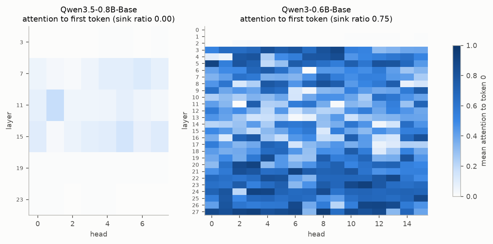

| model | #layers×heads | sink ratio (>0.3) | attn→first mean | attn→first max | v-norm first/rest (median) | o-in norm first/rest (median) | gate first | gate rest | gate<0.1 frac |
|---|---|---|---|---|---|---|---|---|---|
| Qwen3.5-0.8B-Base | 6×8 | 0 | 0.0388 | 0.183 | 1.79 | 1.11 | 0.178 | 0.205 | 0.334 |
| Qwen3-0.6B-Base | 28×16 | 0.75 | 0.458 | 0.955 | 0.143 | 0.507 | – | – | – |

- Qwen3: sink ratio 0.75（Gu et al. の基準 >0.3）、先頭トークンへの平均注意 0.46。先頭トークンの value ノルムは他の 0.14 倍で、典型的な「何もしない」シンク。
- Qwen3.5: **sink ratio 0**（先頭トークンへの注意は平均 0.04、最大 0.18）。先頭トークンの value ノルムはむしろ他の 1.8 倍。代わりに出力ゲート（GA）の値は平均 0.2 と小さく、33% の要素が 0.1 未満。「何もしない」をゲートが担っている（GatedNorm 論文の gating-based rescaling）。

### 2.5 Linear 入力と重み（C, M5, M6, M8）

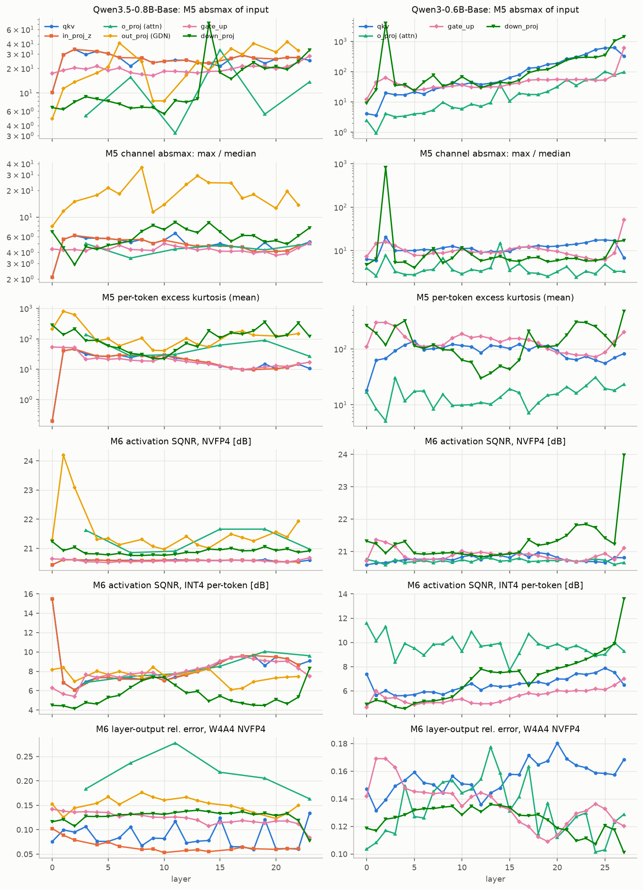
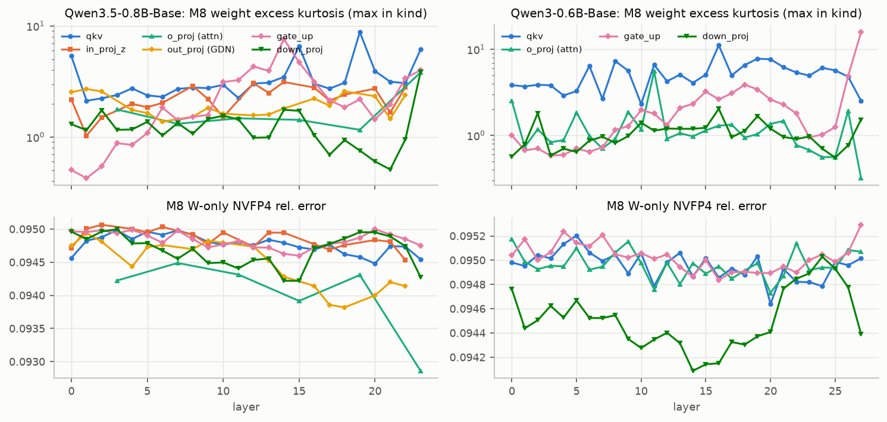

| model | kind | absmax (max) | absmax rest (median) | ch max/med (median) | ch RMS max/med (median) | #ch RMS>6×med (median) | kurt (median) | SQNR INT8 [dB] | SQNR FP8 | SQNR NVFP4 | SQNR INT4 | SQNR INT4 (min) | err W8A8 | err W4A16 | err W4A4 |
|---|---|---|---|---|---|---|---|---|---|---|---|---|---|---|---|
| Qwen3.5-0.8B-Base | qkv | 34.2 | 25.2 | 5.22 | 11.9 | 4 | 19.8 | 32.8 | 32 | 20.6 | 7.81 | 6.07 | 0.0147 | 0.0719 | 0.0763 |
| Qwen3.5-0.8B-Base | in_proj_z | 34.2 | 26.9 | 4.82 | 11.2 | 4 | 19.8 | 32.8 | 32 | 20.6 | 7.81 | 6.07 | 0.01 | 0.0552 | 0.0611 |
| Qwen3.5-0.8B-Base | o_proj | 33.8 | 5.38 | 4.58 | 21.4 | 11.5 | 46.3 | 30.4 | 31.9 | 21.3 | 8.13 | 6.85 | 0.0669 | 0.26 | 0.212 |
| Qwen3.5-0.8B-Base | out_proj | 42.5 | 19.9 | 17.8 | 22.5 | 15 | 114 | 28.1 | 32.3 | 21.3 | 7.62 | 6.11 | 0.0609 | 0.173 | 0.152 |
| Qwen3.5-0.8B-Base | gate_up | 28.4 | 19.3 | 4.27 | 10.5 | 3 | 18.2 | 32.9 | 32 | 20.6 | 7.85 | 5.4 | 0.0196 | 0.103 | 0.107 |
| Qwen3.5-0.8B-Base | down_proj | 71 | 8.44 | 6.15 | 8.39 | 1 | 111 | 26.8 | 32.1 | 20.9 | 5.19 | 4.14 | 0.0471 | 0.131 | 0.131 |
| Qwen3-0.6B-Base | qkv | 620 | 45.1 | 11.5 | 29.8 | 12 | 96.4 | 28.8 | 32.8 | 20.8 | 6.47 | 5.59 | 0.0367 | 0.12 | 0.106 |
| Qwen3-0.6B-Base | o_proj | 101 | 10.2 | 3.35 | 8.97 | 4 | 15.5 | 33.1 | 31.7 | 20.7 | 9.76 | 7.7 | 0.0259 | 0.121 | 0.129 |
| Qwen3-0.6B-Base | gate_up | 604 | 42.1 | 9.22 | 31.4 | 6.5 | 134 | 27.8 | 33.2 | 20.9 | 5.41 | 4.64 | 0.0372 | 0.111 | 0.104 |
| Qwen3-0.6B-Base | down_proj | 3.89e+03 | 60.1 | 6.56 | 10.4 | 3 | 114 | 27.1 | 32.1 | 21.2 | 7.41 | 4.53 | 0.0497 | 0.134 | 0.128 |

重み（M8、層方向の中央値）:

| model | kind | kurtosis median | kurtosis max | absmax/std max | in-ch norm max/med (median) | rel err INT8 | rel err INT4 ch | rel err INT4 g128 | rel err NVFP4 |
|---|---|---|---|---|---|---|---|---|---|
| Qwen3.5-0.8B-Base | qkv | 2.75 | 8.81 | 29.2 | 1.51 | 0.00898 | 0.163 | 0.124 | 0.0947 |
| Qwen3.5-0.8B-Base | in_proj_z | 2.18 | 3.13 | 26.6 | 1.62 | 0.00861 | 0.156 | 0.122 | 0.0949 |
| Qwen3.5-0.8B-Base | o_proj | 1.45 | 3.82 | 26.7 | 2 | 0.0106 | 0.191 | 0.13 | 0.0943 |
| Qwen3.5-0.8B-Base | out_proj | 1.82 | 2.71 | 27.1 | 1.69 | 0.0103 | 0.185 | 0.126 | 0.0946 |
| Qwen3.5-0.8B-Base | gate_up | 0.797 | 7.63 | 27.5 | 1.3 | 0.00851 | 0.154 | 0.122 | 0.0948 |
| Qwen3.5-0.8B-Base | down_proj | 1.16 | 3.85 | 39.1 | 1.48 | 0.0101 | 0.182 | 0.124 | 0.0947 |
| Qwen3-0.6B-Base | qkv | 2.34 | 11.2 | 35.3 | 1.28 | 0.00881 | 0.159 | 0.122 | 0.0949 |
| Qwen3-0.6B-Base | o_proj | 1.01 | 5.56 | 22.7 | 1.4 | 0.0098 | 0.178 | 0.119 | 0.0949 |
| Qwen3-0.6B-Base | gate_up | 0.902 | 15.9 | 38.1 | 1.08 | 0.00859 | 0.156 | 0.121 | 0.0949 |
| Qwen3-0.6B-Base | down_proj | 0.969 | 2.04 | 28.3 | 1.63 | 0.0105 | 0.19 | 0.127 | 0.0945 |

- 絶対値: Qwen3 の Linear 入力は MA の影響で最大 3888（L2 down_proj）、qkv / gate_up でも最大 600 程度。Qwen3.5 は最大 71（L14 down_proj の先頭トークン）で、多くは 20〜40。
- 系統的な外れ値チャネル（チャネル RMS が中央値の 6 倍超）: Qwen3.5 は **GDN out_proj 入力（中央値 15 本、RMS 比 22.5）と o_proj（11.5 本）** が多く、qkv / gate_up（3〜4 本、主に ch 0）、down_proj（1 本）は少ない。Qwen3 は qkv（12 本、RMS 比 30）、gate_up（6.5 本、RMS 比 31）が多い。
- GDN out_proj 入力 = RMSNormGated(core)·SiLU(z) の外れ値チャネルは、特定の (head, dim) にだけ現れ、ヘッド間で共有の Norm 重み（128 次元）とは相関しない（相関 −0.6〜0）。GDN 内部の per-head 正規化の後に生じるもの。計画ではこの Norm を GatedNorm の対象外にしている（§5.1）ので、Phase 2 では監視対象に加える必要がある。
- per-token INT4 の SQNR（中央値）はどの種別も 5〜8 dB で、種別間の差は小さい。後述の ΔPPL の差（数十倍）を SQNR の中央値だけでは説明できない。
- 重み（M8）: 両モデルとも大差ない。超過尖度の中央値は 1〜3、INT4 g128 の相対誤差は 0.12〜0.13、NVFP4 は 0.095。

### 2.6 RTN fake-quant ΔPPL（F）

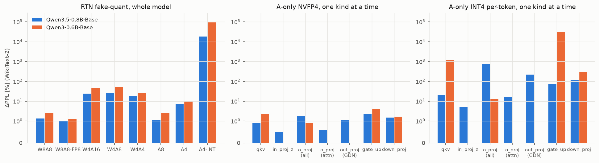

| setting | Qwen3.5-0.8B-Base PPL | Qwen3.5-0.8B-Base ΔPPL % | Qwen3-0.6B-Base PPL | Qwen3-0.6B-Base ΔPPL % |
|---|---|---|---|---|
| bf16 | 13.12 | 0 | 12.67 | 0 |
| W8A8 | 13.3 | 1.337 | 13 | 2.665 |
| W8A8-FP8 | 13.25 | 0.999 | 12.83 | 1.249 |
| W4A16 | 16.26 | 23.94 | 18.54 | 46.37 |
| W4A8 | 16.48 | 25.63 | 19.24 | 51.87 |
| W4A4 | 15.51 | 18.25 | 16.01 | 26.4 |
| A8 | 13.26 | 1.074 | 12.99 | 2.527 |
| A4 | 14.09 | 7.369 | 13.87 | 9.523 |
| A4-INT | 2436 | 1.847e+04 | 1.205e+04 | 9.501e+04 |
| A4 @down_proj | 13.31 | 1.463 | 12.88 | 1.649 |
| A4 @gate_up | 13.42 | 2.307 | 13.17 | 3.991 |
| A4 @in_proj_z | 13.18 | 0.4836 | – | – |
| A4 @o_proj | 13.36 | 1.801 | 12.78 | 0.925 |
| A4 @qkv | 13.24 | 0.9201 | 12.95 | 2.263 |
| A4 @out_proj | 13.27 | 1.16 | – | – |
| A4 @o_proj_attn | 13.2 | 0.5917 | – | – |
| A4-INT @down_proj | 28.48 | 117.1 | 51.23 | 304.5 |
| A4-INT @gate_up | 22.94 | 74.81 | 3911 | 3.078e+04 |
| A4-INT @in_proj_z | 13.8 | 5.159 | – | – |
| A4-INT @o_proj | 110.4 | 741.8 | 14.26 | 12.57 |
| A4-INT @qkv | 15.84 | 20.73 | 159.3 | 1158 |
| A4-INT @out_proj | 41.76 | 218.3 | – | – |
| A4-INT @o_proj_attn | 15.22 | 16.04 | – | – |

- 全体: W8A8（INT8）で Qwen3.5 +1.3% / Qwen3 +2.7%、W4A16（INT4 g128）で +24% / +46%、W4A4（NVFP4）で +18% / +26%。**Qwen3.5 のほうが一貫して量子化に強い**（パラメータ数が多いことの影響は切り分けていない）。
- 活性だけ 4bit: NVFP4（block 16）なら +7% / +10% で済むが、**per-token INT4 では両モデルとも崩壊**（PPL 2436 / 12048）。
- 1 種別ずつ INT4 化したときのボトルネックがモデルで違う:
  - Qwen3: **gate_up（PPL 3911）≫ qkv（159）≫ down_proj（51）≫ o_proj（14.3）**。Norm 出力を読む Linear が壊れる。
  - Qwen3.5: **o_proj/out_proj（110）≫ down_proj（28）> gate_up（23）> qkv（15.8）> in_proj_z（13.8）**。Norm 出力側（qkv / gate_up）は比較的軽い。o_proj 種別を分けると、**GDN out_proj だけで 41.8**、Attention o_proj だけで 15.2（両方で 110）で、主因は GDN out_proj の入力（RMSNormGated 出力）の外れ値チャネル。

**層ごとの切り分け**（per-token INT4 を 1 つの（層, 種別）だけに入れる。WikiText-2 の 24 窓、`scripts/phase1_quant_layers.py`）:

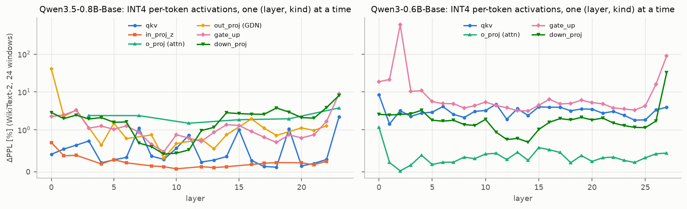

| モデル | 最悪の（層, 種別） | ΔPPL | 2 番目以降 |
|---|---|---|---|
| Qwen3-0.6B | **L2 gate_up（step-up ブロックの MLP 入力）** | **+595%** | L27 gate_up +89%、L27 down_proj +32%（step-down ブロック）、L0/L1 gate_up +19〜21% |
| Qwen3.5-0.8B | **L0 GDN out_proj** | **+41%** | L23 gate_up +8.9%、L23 down_proj +8.1%、ほかは 4% 以下 |

Qwen3 の L2 について、INT4 化をトークンで分けると（`scripts/phase1_stepup_quant_check.py`）:

| INT4 を入れるトークン | ΔPPL | 次層に入る先頭トークンの max \|h\| |
|---|---|---|
| 全トークン | +595% | 93.5 |
| **先頭トークンだけ** | **+495%** | **93.5** |
| 先頭以外だけ | +9.6% | 7232 |

**Qwen3 の INT4 崩壊は、step-up ブロックの MLP 入力にある先頭トークンの精密な「トリガー方向」が量子化で壊れ、MA（7200 → 94）が生成されなくなることで起きる。** MA が attention sink を支えているので、それが消えると全体が崩れる。外れ値の大きさそのものではなく、**外れ値を作る仕組みが量子化に弱い**。Qwen3.5 には MA も step-up ブロックも無いので、この崩壊様式が無い。


### 2.7 因果プローブ: シンク次元のアブレーション（E）

各 Norm 入力のシンク次元（Qwen3.5: 主に dim 0、Qwen3: 主に dim 35。最終 norm は Qwen3.5 で dim 16）に、非先頭トークンについて介入した。残差ストリーム自体は変えず、**Norm が見る入力だけ**を変える。

- mean: x_d ← E[x_d]（プローブの非先頭トークン平均）
- zero: x_d ← 0
- direct only（zero の分解）: Norm 出力の y_d だけを 0 にする（シンクが Linear に直接渡す成分だけを除去）
- denominator only（zero の分解）: y_d は残し、他の次元を rms(x)/rms(x with x_d=0) 倍する（再スケールのレバーだけを除去）
- clamp: |x_d| ≤ τ·rms(x_{−d})（Phase 2 の正則化 τ=8 が強制する状態を学習なしで作ったもの）

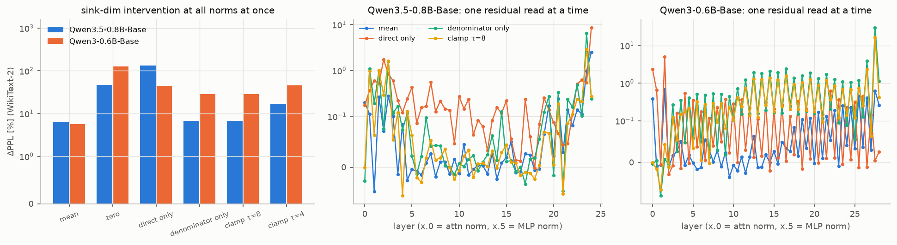

**Qwen3.5-0.8B-Base** (sink dims: 0, 4, 16, 347)

| setting | PPL (all norms) | ΔPPL % (all norms) | single-read ΔPPL % median | single-read ΔPPL % max | worst single read |
|---|---|---|---|---|---|
| mean | 13.93 | 6.194 | 0.02004 | 2.488 | model.norm |
| zero | 19.23 | 46.58 | 0.1897 | 8.403 | model.norm |
| direct_zero | 30.65 | 133.6 | 0.1466 | 8.587 | model.norm |
| denom_zero | 14.01 | 6.753 | 0.04138 | 6.545 | L23.post_attention_layernorm |
| clamp τ=4 | 15.32 | 16.75 | 0.1041 | 4.724 | L23.post_attention_layernorm |
| clamp τ=8 | 14.01 | 6.747 | 0.02239 | 2.895 | L23.post_attention_layernorm |

**Qwen3-0.6B-Base** (sink dims: 27, 35, 277)

| setting | PPL (all norms) | ΔPPL % (all norms) | single-read ΔPPL % median | single-read ΔPPL % max | worst single read |
|---|---|---|---|---|---|
| mean | 13.38 | 5.632 | 0.027 | 0.6779 | L1.post_attention_layernorm |
| zero | 28.8 | 127.4 | 0.4895 | 29.72 | L27.post_attention_layernorm |
| direct_zero | 18.36 | 44.94 | 0.05047 | 5.024 | L1.post_attention_layernorm |
| denom_zero | 16.3 | 28.64 | 0.2077 | 29.8 | L27.post_attention_layernorm |
| clamp τ=4 | 18.5 | 46.01 | 0.365 | 25.74 | L27.post_attention_layernorm |
| clamp τ=8 | 16.31 | 28.74 | 0.2336 | 16.52 | L27.post_attention_layernorm |

- **両モデルとも mean ablation は安い（+5.6〜6.2%）**。どちらのシンクもほぼ入力に依らない定数として働いている。§2.8 の入力依存性（英語 / 日本語 / コードでシンク次元が同じ）とも整合する。
- **Qwen3 は論文の「再スケール因子」像に一致する。** zero で +127%。分母だけ除去（+29%）でも直接成分だけ除去（+45%）でも大きく、両方の役割がある。読み出し 1 つずつで見ると、分母の効果は MLP 入力（post_attention_layernorm。λ ≈ 3e-5 で直接成分はほぼ 0）に集中し、step-down の L27 だけで +30% になる。直接成分の効果は Attention 入力（input_layernorm。λ ≈ 0.6）側にある。
- **Qwen3.5 は違う。** 分母だけの除去は +6.8% と小さく、**直接成分だけの除去が +134%** と最大（zero の +47% よりも大きい。zero では分母が小さくなって他の次元が拡大され、一部が補償されるとみられる）。dim 0 は「Norm の分母を通した再スケール」よりも、**λ ≈ 1 で Linear にそのまま渡る入力非依存のバイアス的な特徴**として使われている。影響は深さ方向に分散しており、読み出し 1 つずつの効果は中央値 0.1〜0.2% と小さく、最後の数層（L23 MLP 入力、最終 norm）で数 % になる。
- **clamp τ=8（学習なし）のコストは Qwen3.5 で +6.7%、Qwen3 で +29%**。Phase 2 の正則化が狙う状態（ピーク |u| ≤ 8）までの距離は、Qwen3.5 のほうがずっと近い。

**追加の検証: 直接成分は定数（バイアス）か**（`scripts/phase1_ablate_bias.py`、全 Norm 同時、WikiText-2）。E[y_d] は C4 プローブ 32 本での Norm 出力のシンク次元の平均。

| 介入 | Qwen3.5-0.8B ΔPPL | Qwen3-0.6B ΔPPL |
|---|---|---|
| direct_const: y_d ← E[y_d]（分母はそのまま） | +4.5% | +1.7% |
| remove_const: Norm 内で x_d ← 0、かつ y_d ← E[y_d]（シンクを Norm から完全に除き、直接成分を定数 = Linear のバイアスに置き換える） | **+9.5%** | +31% |

- どちらのモデルでも、シンクの直接成分は大部分が定数（トークンに依らないバイアス）で置き換えられる。
- **Qwen3.5 では、シンクを Norm から完全に取り除いても、直接成分を定数バイアスに畳み込めば学習なしで +9.5% しか悪化しない。** Qwen3.5 の Linear はバイアスを持たないため、dim 0 は「全 Linear に共通のバイアスを供給するチャネル」として使われていると解釈できる。
- Qwen3 では同じ操作で +31%（分母の役割 +29% がそのまま残る）。こちらのシンクは再スケールのレバーで、バイアスでは代替できない。

### 2.8 入力依存性（英語 / 日本語 / コード）

C4（英語）のプローブに加え、Wikipedia ja（`wikimedia/wikipedia` 20231101.ja の shard 14）と Python コード（site-packages 内の .py）からそれぞれ 32 文書 × 2048 token を取り、残差統計だけを取り直した（`scripts/phase1_input_dependence.py`）。

| model | domain | sink dim | share of reads | M2 median | argmax-hit median | M3 p50 median | max \|h\| first |
|---|---|---|---|---|---|---|---|
| Qwen3.5-0.8B-Base | en | 0 | 0.958 | 18.3 | 0.615 | 10.6 | 6.75 |
| Qwen3.5-0.8B-Base | ja | 0 | 0.979 | 20.2 | 0.746 | 11.1 | 6.75 |
| Qwen3.5-0.8B-Base | code | 0 | 0.896 | 17.2 | 0.651 | 10.6 | 7.56 |
| Qwen3-0.6B-Base | en | 35 | 0.929 | 38.1 | 0.968 | 17.1 | 7.2e+03 |
| Qwen3-0.6B-Base | ja | 35 | 0.982 | 34.9 | 0.964 | 15.8 | 7.14e+03 |
| Qwen3-0.6B-Base | code | 35 | 0.982 | 31.2 | 0.944 | 16 | 6.59e+03 |

シンク次元は言語・ドメインによらず同じ（Qwen3.5: dim 0、Qwen3: dim 35）で、M2 / M3 の水準もほとんど変わらない。両モデルのシンクは入力非依存である（論文の residual sink の性質と一致）。

### 2.9 Base と Instruct の比較（G）

| model | WikiText-2 PPL | max \|h\| (final norm 除く) | sink dim | M2 median | M3 p50 median | \|λ\| @sink mlp-norm | sink ratio | down_proj absmax | SQNR INT4 median |
|---|---|---|---|---|---|---|---|---|---|
| Qwen3.5-0.8B Base | 13.1 | 9.19 | 0 | 18.2 | 10.6 | 0.816 | 0 | 71 | 7.65 |
| Qwen3.5-0.8B Instruct | 17.2 | 7.88 | 0 | 22.4 | 12 | 0.815 | 0 | 73.5 | 7.28 |
| Qwen3-0.6B Base | 12.7 | 7.2e+03 | 35 | 38.3 | 17.2 | 2.83e-05 | 0.75 | 3.89e+03 | 6.36 |
| Qwen3-0.6B Instruct | 21 | 7.26e+03 | 35 | 36.8 | 16.9 | 8.92e-05 | 0.721 | 3.9e+03 | 6.32 |

Instruct 版でも、シンク次元・M2 / M3・シンク次元の λ・sink ratio・MA の大きさはほぼ変わらない。後学習は外れ値の構造をほとんど変えていない（WikiText-2 の PPL は後学習の影響で Instruct のほうが高い）。

---

## 3. 仮説の検証

| 仮説 | 判定 | 根拠 |
|---|---|---|
| H1a: Qwen3-0.6B は先頭・区切りトークンの中間層に MA（数百以上）を持ち、attention sink も強い | **先頭トークンについては支持、区切りトークンは不支持** | 先頭トークンの dim 35 が L2〜L27 で 7200（全 128 系列）。sink ratio 0.75。区切りトークンは最大 650 まで育つが、他トークンの p99.9 と同程度で MA 基準を満たすものは 0 |
| H1b: Qwen3.5-0.8B は attention sink / MA が弱いが residual sink は残り、シンク次元の λ_eff は極端に小さい | **前半は支持、後半（λ_eff ≪ 1）は棄却** | MA なし（最大 21）、sink ratio 0。dim 0 の residual sink は 46/48 の読み出しで M2 ≥ 10、入力非依存。ただし λ_eff は 0.8〜1.2 で、シンクは Linear 入力にそのまま届く |
| H1c: 活性の量子化誤差は両モデルとも down_proj 入力が支配的。residual sink は Norm 重みで潰されるので通常の A 量子化への直接の影響は限定的 | **棄却（モデル依存）** | per-token INT4 を 1 種別ずつ入れると、Qwen3 は gate_up（PPL 3911）と qkv（159）、Qwen3.5 は GDN out_proj（単独で 41.8）が最悪で、down_proj はどちらも 2〜3 番手。Qwen3 の崩壊は step-up ブロック（L2）の MLP 入力の先頭トークンだけで起きる（MA 生成の破壊）。residual sink が Norm で潰されるのは Qwen3 の MLP 入力だけで、Qwen3.5 では ch 0 の外れ値として qkv / gate_up に届く |


---

## 4. G0 判定と Phase 2 への示唆

### 4.1 計画の基準（§4.4）に照らした判定: Qwen3.5-0.8B

| 基準 | 実測 | 判定 |
|---|---|---|
| 多くの層で M2 ≥ 10 | 46/48 の読み出し（中央値 18.2） | 満たす |
| M4 でシンク次元の λ_eff ≪ 1 | input_layernorm 1.18 / post_attention_layernorm 0.82（中央値） | **満たさない** |
| M3 の p50 ≳ 10 | 中央値 10.6（29/48 が 10 以上、最大 19.5） | 境界上だが満たす |

residual sink は「弱い / 無い」わけではない。はっきり存在し、入力にも依らない。ただし λ の条件を満たさず、**機構が計画の前提（Norm の分母を通した再スケール因子）と違う**。

- 分母の役割だけを除くと +6.8%、直接成分だけを除くと +134%。
- 直接成分はほぼ定数（バイアス）。シンクを Norm から完全に除き、直接成分を定数に置き換えても、学習なしで +9.5% にとどまる。

したがって、**G0 は「Go / No-Go」の二択では判定しにくく、方針の相談が必要**と判断する（§4.4 の「弱い / 無い場合は相談」に準じる）。

### 4.2 Phase 2 への示唆

1. **Qwen3.5 では、GatedNorm の「代替の再スケール経路」は本質的でない可能性が高い。** シンクが担っているのは加算的な定数（バイアス）で、要素ごとの乗算ゲート y ⊙ g はこれを表現しにくい（y_j が 0 付近を通るトークンでは y_j·g_j で定数を作れない）。このため Track A の A1（元構造）と A2（GatedNorm 付き）の差は出にくいと予想する。一方、Norm 出力を読む Linear にバイアスを足すだけで、シンクを小さい劣化で落とせる見込みが高い（学習なしで +9.5%）。
2. **Qwen3-0.6B は論文の像にそのまま当てはまる**（MLP 入力での λ ≈ 3e-5、分母だけの除去で +29%、MA 7200、sink ratio 0.75）。GatedNorm 後付けの仮説 H2 の検証対象としては、こちらのほうが素直。ただし dim 35 は先頭トークンの MA と attention sink も担っているため、計画 §4.4 (a) のとおり GA の後付けも必要になる。量子化の面でも、Qwen3 の INT4 崩壊は MA を作る step-up ブロックに起因するので、GA＋GatedNorm で MA とシンクを不要にできれば、崩壊様式そのものを取り除ける可能性がある（改善の余地が大きい）。
3. **量子化の観点**: Qwen3.5 の per-token INT4 のボトルネックは GDN out_proj / o_proj と down_proj で、残差 Norm に付ける GatedNorm では直接触れない。qkv / in_proj_z / gate_up の ch 0 外れ値は、シンクを消せば直接改善する。NVFP4（block 16）なら活性 4bit でも現状 +7% で、W4A4 NVFP4 の劣化（+18%）の大半は重み側。
4. **監視項目の追加**: GDN out_proj 入力（RMSNormGated 出力）の per-head 外れ値チャネル。Qwen3.5 の最終 norm ではシンク次元が dim 16 に変わる点。

### 4.3 選択肢（要判断）

| 案 | 内容 | 長所 | 短所 |
|---|---|---|---|
| A: 計画どおり＋対照追加 | Qwen3.5 で Track A。A1 / A2 に加え、**A5: Norm 出力を読む Linear（qkv / in_proj_z / gate_up）にゼロ初期化バイアスを追加**する対照を入れる | 実装済みの計測基盤がそのまま使える。「ゲートとバイアスのどちらが効くか」を直接比べられる | GatedNorm の優位が出ない可能性が高い（それ自体は結果になる） |
| B: 対象を変更 | 主対象を Qwen3-0.6B にし、GA＋GatedNorm を後付け（§4.4 (a)） | 論文の機構と合う。外れ値も改善余地も大きい（INT4 で崩壊、W4A16 +46%） | GA の後付けで実装・調整が増える。Hybrid ではない |
| C: 両方（推奨） | まず案 A を縮小版（λ 2 水準 × A1 / A2 / A5、各 ~200M token）で実施し、その後に案 B を主実験として行う | Qwen3.5 の新しい知見（バイアス的シンク）と、論文の機構の検証を両方押さえられる | Phase 2 の計算量が増える（縮小版 A は 6 本 × 200M ≈ 1.2B token、約 2 日） |

推奨は **案 C**。Qwen3.5 で「シンクがバイアスなら、ゲートよりバイアスで置き換わるはず」という予測は安く検証でき、外れていれば GatedNorm の優位を示す結果にもなる。


---

## 5. 再現手順

```bash
uv sync
uv run python scripts/check_fla.py                      # fla の動作確認 → results/phase1/check_fla.json
uv run python scripts/phase1_make_probe.py              # data/probe_c4_docs.json（git 管理済み）
for m in qwen3.5-0.8b qwen3-0.6b; do
  uv run python scripts/phase1_measure.py --model $m     # M1〜M8, PPL/BPB
  uv run python scripts/phase1_quant_probe.py --model $m # RTN ΔPPL
  uv run python scripts/phase1_ablate_sink.py --model $m # シンクのアブレーション
  uv run python scripts/phase1_quant_layers.py --model $m
  uv run python scripts/phase1_step_up.py --model $m     # ‖U_k‖_F, super weight
  uv run python scripts/phase1_ablate_bias.py --model $m # 直接成分の定数置換
done
uv run python scripts/phase1_stepup_quant_check.py      # Qwen3 L2 の先頭トークン INT4
uv run python scripts/phase1_input_dependence.py        # 英語 / 日本語 / コード
uv run python scripts/phase1_measure.py --model qwen3.5-0.8b-instruct   # G（任意）
uv run python scripts/phase1_measure.py --model qwen3-0.6b-instruct
uv run python scripts/phase1_plots.py                   # docs/reports/figs/phase1/*.png
uv run python scripts/phase1_summary.py > results/phase1/summary.md   # 集計表（Markdown）
uv run python scripts/phase1_wandb_summary.py           # 追加の結果を wandb に記録
uv run pytest                                           # 単体テスト + 実モデルの統合テスト（GPU）
```
