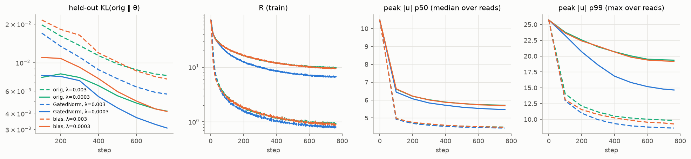
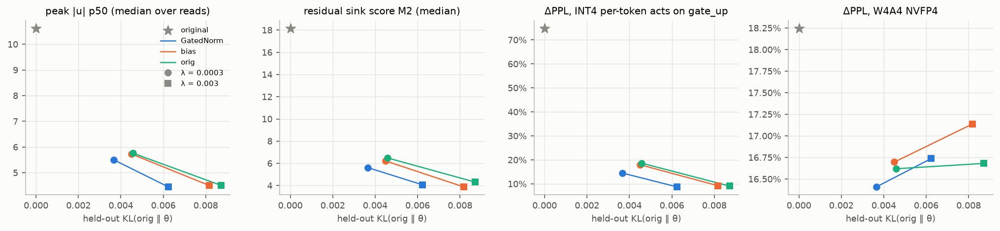

# Phase 2 中間レポート（C1）: Qwen3.5-0.8B-Base への GatedNorm / バイアスの後付け

- 作成: 2026-09-25 / 計画: [20260923-phase2-optionC-plan.md](../plans/20260923-phase2-optionC-plan.md)（案 C の C1。判定ゲート G2）
- 生データ: `results/phase2/c1/<run>/`（metrics.jsonl、probe/、eval/summary.json）、wandb: group `phase2-c1` / `phase2-c1-pilot` / `phase2-eval`
- 図表: `scripts/phase2_compare.py --pattern "c1/*" --base-eval results/phase2/base-qwen3.5-0.8b/eval/summary.json`

---

## 0. 要約

- **問い**: Qwen3.5 の残差シンク（dim 0。Phase 1 ではバイアス的な直接成分として働いていた）を、正則化付きの蒸留で取り除くとき、**GatedNorm（A2）やゼロ初期化バイアス（A5）を後付けすると、元の構造（A1）より少ない劣化で済むか**。
- **結論**:
  - **A2（GatedNorm）は、両方の λ で A1 をパレート的に上回った。** 同じ λ で held-out KL は −20%（λ = 3e-4）/ −28%（λ = 3e-3）。λ = 3e-4 では外れ値も A1 より少ない。M2（残差シンクスコア）をそろえて補間すると、KL はおよそ −37%。ただし計画の成功基準（同じ外れ値水準で KL が半分以下）には届かず、**効果は中程度**。
  - **A5（バイアス）は A1 とほぼ同じ**（KL −2〜6%）。バイアスはシンクの直接成分を置き換えられる大きさ（0.03〜0.09）まで育ち、実際に使われているが、利点にはならなかった。Phase 1 からの予測「A5 ≧ A2 ≈ A1」は外れた。
  - **3 アームとも、PPL +0.4〜1.1%、zero-shot ±0.2 ポイント以内で残差シンクはほぼ消えた**（M2 18.2 → 3.9〜6.5、ピーク \|u\| p50 10.6 → 4.5〜5.8）。正則化の対象である Linear 入力（qkv / gate_up）の per-token INT4 劣化は 1/4〜1/8 に減った。
  - 一方、**モデル全体の INT4 崩壊（主因は GDN out_proj と down_proj の入力）や W4A4 NVFP4 の劣化（主に重み側）はほとんど変わらない**。残差 Norm の正則化では、これらには届かない。
- **パイロットで見つかった 2 つの落とし穴**（本番の設定に反映済み）:
  1. τ = 8 では、シンクは別の次元に移って閾値のすぐ下に残る（分散による逃げ）。本番は τ = 4 とした。
  2. 正則化を Norm の入力だけにかけると、GatedNorm は残差からシンクを消し、ゲートで同じ次元を約 1.6 倍に作り直す。KL と R は良く見えるが、量子化される Linear 入力はかえって悪化する。本番は Norm の入力と出力の両方にかけた（`--reg-site both`）。

---

## 1. 設定

| 項目 | 内容 |
|---|---|
| アーム | A1: 元の構造（全重み）/ A2: ＋GatedNorm（残差 Norm 49 個、rank 16、`2σ` で恒等初期化、1.6M パラメータ）/ A5: ＋ゼロ初期化バイアス（残差 Norm の出力を読む全 Linear、0.6M パラメータ） |
| 損失 | KL(p_orig ‖ p_θ) ＋ λ·R。R は Norm の入力と出力のそれぞれで `Σ_j ReLU(|u_j| − τ)²`（u = x/rms(x)）のトークン平均をとり、全 Norm で平均。**τ = 4**、λ ∈ {3e-4, 3e-3} |
| データ | FineWeb-Edu sample-10BT（shard 000）を 2048 token に packing。200M token（762 step × 128 系列）。全アームで同じ順序 |
| 最適化 | AdamW (0.9, 0.95)。元の重みは LR 2e-5（WD 0.1 は Linear 重みのみ）、新規パラメータは LR 1e-3（A2）/ 1e-2（A5）。warmup 3%、cosine で 10% まで減衰。fp32 マスター＋bf16 autocast、勾配チェックポイント |
| 教師 | 元モデル（fp32、学生と同じ autocast 経路）。すべてのアームで初期 KL は厳密に 0（恒等初期化はビット一致をテストで確認） |
| 評価 | WikiText-2 PPL、held-out KL（FineWeb-Edu shard 013、64×2048）、Phase 1 の外れ値指標（C4 プローブ 128 本）、RTN fake-quant ΔPPL、lm-eval zero-shot 6 タスク |
| 計算 | RTX 5090、約 9.6K tok/s、1 本あたり学習 約 5.8 時間＋評価 約 30 分 |

計画（元計画 §5）からの変更は、τ = 8 → 4、正則化の適用箇所（Norm の入力 → 入力と出力の両方）、新規パラメータの LR をアームごとに選んだこと。いずれもパイロットの結果による（計画の追補 §8 に経緯あり）。

---

## 2. パイロットからの知見（各 50M token）

| 設定（A1 または指定のアーム） | held-out KL | 結果 |
|---|---|---|
| A1、τ = 8、λ = 1e-3 | 0.0042 | R −92%。ただしシンクは dim 0 → dim 4 に移り、ピーク p50 7.7 と閾値のすぐ下に残る |
| A1、τ = 8、λ = 1e-2 | 0.0071 | R −99.5%。τ = 8 は元の構造でもほぼ無償で達成でき、アーム間の差が出ない |
| A1、τ = 4、λ = 1e-3 | 0.0107 | 外れ値が実際に減る（p50 5.5、上位 4 次元のエネルギー比 0.25 → 0.09） |
| A2、τ = 4、Norm の入力だけに正則化 | 0.0076 | R と KL は最良。しかしゲートがシンク次元を約 1.6 倍に増幅し、Linear 入力の外れ値チャネルは A1 より大きい（gate_up 入力の ch RMS 比 7.1 vs 5.3、A4-INT +7851% vs +5602%） |
| A2、τ = 4、入力と出力の両方に正則化 | 0.0085 | 抜け道がふさがる（ゲートと \|y\| の相関 +0.47 → +0.07）。A1（同条件 0.0102）を全指標で上回る |
| A5、新規 LR 1e-3 → 1e-2 | 0.0106 → 0.0103 | LR 1e-3 ではバイアスが必要な大きさ（0.03〜0.13）に育たない。1e-2 にしても A1 との差は小さい |

---

## 3. 本番の結果（各 200M token）




| アーム | λ | held-out KL | WikiText-2 PPL | M2 | peak p50 | A4-INT @qkv | A4-INT @gate_up | A4-INT 全体 | W4A4 | lm-eval 平均 | 新規部分を戻したときの KL |
|---|---|---|---|---|---|---|---|---|---|---|---|
| 元モデル | – | 0 | 13.12 | 18.2 | 10.6 | +20.7% | +74.8% | +18466% | +18.3% | 0.5754 | – |
| A1 | 3e-4 | 0.0046 | 13.18 | 6.49 | 5.76 | +5.9% | +18.6% | +6549% | +16.6% | 0.5748 | – |
| **A2** | 3e-4 | **0.0037** | **13.16** | **5.62** | **5.51** | **+5.5%** | **+14.5%** | **+5048%** | **+16.4%** | 0.5747 | 0.032 |
| A5 | 3e-4 | 0.0045 | 13.17 | 6.21 | 5.73 | +5.8% | +18.0% | +6568% | +16.7% | 0.5756 | 0.011 |
| A1 | 3e-3 | 0.0087 | 13.26 | 4.31 | 4.51 | +3.5% | +9.1% | +4092% | +16.7% | 0.5737 | – |
| **A2** | 3e-3 | **0.0062** | **13.23** | 4.07 | 4.45 | +3.4% | +8.8% | +4021% | +16.7% | 0.5731 | 0.042 |
| A5 | 3e-3 | 0.0082 | 13.25 | 3.88 | 4.50 | +3.6% | +9.2% | +4478% | +17.1% | 0.5730 | 0.027 |

- **機能の劣化はどれも小さい**: PPL +0.3〜1.1%、zero-shot 平均の差は ±0.2 ポイント以内（評価のばらつきの範囲）。
- **外れ値**: 残差シンクはほぼ消えた（M2 18.2 → 3.9〜6.5）。Linear 入力（qkv / gate_up）のチャネル RMS 比は 11.6 / 10.4 → 3.4〜5.2。
- **A2 と A1**: 同じ λ で KL は −20% / −28%。λ = 3e-4 では外れ値（M2 −13%、gate_up の INT4 劣化 −22%、全体の A4-INT −23%）も少ない。λ = 3e-3 では外れ値はほぼ同じ。M2 をそろえて補間すると KL は約 −37%（A1 の 2 点を対数補間）。
- **A5 と A1**: KL は −2〜6%、外れ値もほぼ同じ。バイアスは平均絶対値 0.02〜0.09 まで育ち、0 に戻すと KL は 0.0082 → 0.027 に上がる（使われてはいる）。
- **ゲートの働き（A2）**: ゲートの平均は 0.94、最小の次元でも平均 0.76 で、0.5 を下回る要素はない。ゲートを 1 に戻すと KL は 6〜7 倍になる（0.0062 → 0.042）。|y| とゲートの相関は +0.26〜0.31 で、論文の「|y| が大きい次元ほどゲートが小さい」とは逆向き。後付けでは、ゲートは外れ値を抑える方向ではなく、残差から消えた成分の一部を補う方向に使われている。
- **量子化**:
  - 正則化の対象の Linear 入力では、per-token INT4 の劣化が 1/4〜1/8 に減った。
  - しかしモデル全体の INT4 崩壊は、GDN out_proj（Phase 1 で主因と特定。A4-INT @o_proj は +486〜581% のまま）と down_proj が支配しており、まだ解消していない。
  - W4A4 NVFP4（+16.4〜17.1%）の差は小さい。NVFP4 の活性量子化（block 16）はもともと外れ値に強く、劣化の大半は重み側にあるため。

### 推論オーバーヘッド（PyTorch eager、HF generate、バッチ 1、融合なし）

| 後付け | prefill（2048 token） | decode（1 token あたり） |
|---|---|---|
| GatedNorm | +9.7% | +17.8% |
| バイアス | +9.2% | +10.8% |

decode の増分は、小さなカーネルが 49 か所で増えることによる起動オーバーヘッドが主。融合カーネルにすれば大きく減る見込み（論文は hidden 2048 で 5〜8%）。

---

## 4. 解釈

1. **GatedNorm の利点は後付けでも出る。ただし中程度。** 同じ外れ値水準での KL の削減は 2〜4 割で、「外れ値を機能的に置き換える代替経路」として働いているのは確か（ゲートを外すと KL が 6〜7 倍）。一方、ゲートは外れ値を抑える向きではなく、残差から消えた成分を補う向きに学習されている。
2. **Phase 1 の「バイアス的シンク」仮説は、学習では利点につながらなかった。** 学習なしのアブレーションでは、シンクを定数バイアスに置き換えても +9.5% だった。それでも、KL 蒸留の中で元の重みも一緒に更新できる状況では、元の構造（A1）も同じくらい安くシンクを消せる。つまり、Qwen3.5 のシンクは「消しにくい」ものではなかった。
3. **Qwen3.5 のシンクは安く消せる。** 元の構造でも、PPL +0.4〜1.1% でシンクがほぼ消えた。アーム間の差が中程度にとどまるのは、そもそも改善の余地が小さいため。改善の余地が大きいのは、MA と attention sink を持ち、シンクが再スケールのレバーとして効いている Qwen3（C2）。
4. **量子化への効果は、正則化をかけた場所に限られる。** Norm の出力を読む Linear は大きく改善した。しかし、全体の INT4 崩壊の主因（GDN out_proj の入力、down_proj の入力）は Norm の外にある。全体を改善するには、GDN 内部の RMSNormGated の出力や MLP の中間活性にも同じ種類の正則化（または GatedNorm）を広げる必要がある。

---

## 5. C2 への反映

- 正則化は最初から Norm の入力と出力の両方（`--reg-site both`）、τ = 4 とする。
- Qwen3 の本丸は、先頭トークンの MA（step-up ブロック）と attention sink。パイロットでは、先頭トークンの重み（1 と 256）、GA の粒度（head-wise と element-wise）、GA 単独と GA＋GatedNorm を比べる。評価には M7（sink ratio）を加える。
- 量子化の評価では、Phase 1 で見つけた「step-up ブロックの先頭トークンを INT4 にすると MA が消えて崩壊する」現象が、GA＋GatedNorm で解消するかを見る。
- バイアス（A5）は C2 では外す（C1 で利点がなかったため）。

---

## 6. 再現

```bash
uv run python scripts/prepare_fineweb.py --model qwen3.5-0.8b
uv run python scripts/eval_retrofit.py --base qwen3.5-0.8b
for lam in 3e-3 3e-4; do
  uv run python scripts/train_retrofit.py --model qwen3.5-0.8b --run c1/A1-lam$lam --group phase2-c1 --tau 4 --reg-site both --tokens 200e6 --lam $lam
  uv run python scripts/train_retrofit.py --model qwen3.5-0.8b --run c1/A2-lam$lam --group phase2-c1 --tau 4 --reg-site both --tokens 200e6 --lam $lam --gated-norm --lr-new 1e-3
  uv run python scripts/train_retrofit.py --model qwen3.5-0.8b --run c1/A5-lam$lam --group phase2-c1 --tau 4 --reg-site both --tokens 200e6 --lam $lam --linear-bias --lr-new 1e-2
done
for d in results/phase2/c1/*/; do uv run python scripts/eval_retrofit.py --ckpt $d/final.pt; done
uv run python scripts/latency_retrofit.py --model qwen3.5-0.8b
uv run python scripts/phase2_compare.py --pattern "c1/*" --out docs/reports/figs/phase2-c1 \
  --base-eval results/phase2/base-qwen3.5-0.8b/eval/summary.json
```
