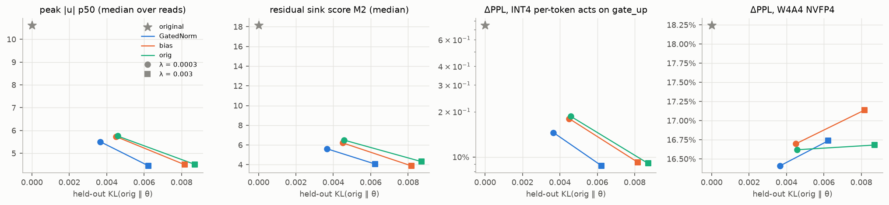

# Phase 2 最終レポート: 学習済み LLM への GatedNorm 後付け FT（案 C）

- 作成: 2026-09-27 / 計画: [元計画 §5](../plans/20260923-gatednorm-retrofit-plan.md)、[案 C の追補](../plans/20260923-phase2-optionC-plan.md)（§8・§9 にパイロットの経緯）
- 関連: [Phase 1 レポート](./phase1-outliers.md)、[C1 中間レポート](./phase2-c1.md)
- 生データ: `results/phase2/{c1,c2,c1-pilot,c2-pilot}/<run>/`、wandb: group `phase2-c1` / `phase2-c2` / `*-pilot` / `phase2-eval`

---

## 0. 要約

| 段階 | モデル | 後付け | 主な結果 |
|---|---|---|---|
| C1 | Qwen3.5-0.8B-Base（Hybrid GDN＋GA） | GatedNorm / ゼロ初期化バイアス | GatedNorm は元の構造より KL が 2〜4 割低く、パレート優位（中程度）。バイアスは利点なし。どのアームも PPL +0.3〜1.1% で残差シンクがほぼ消える |
| **C2** | **Qwen3-0.6B-Base（全層 Softmax）** | **GA＋GatedNorm** | **同じ正則化で、元の構造より KL が半分（−45%）、zero-shot は元モデルより +0.5 ポイント、先頭トークンの MA 7200 → 248。W4A16 / W4A4 / per-token INT4 は元の構造より大幅に良い** |

1. **C2 で計画の主仮説 H2 が成り立った。** 先頭トークンの MA と残差シンクに強い正則化をかけると、GA＋GatedNorm を後付けしたモデル（B3h）は、元の構造（B1）より少ない劣化で外れ値を落とせる。λ = 3e-3 で held-out KL 0.029 vs 0.053（−45%）、WikiText-2 PPL +4.4% vs +7.6%、zero-shot 平均 0.558 vs 0.551（元モデル 0.554）。先頭トークンの MA は 7200 → 248（B1 は 1696）。計画 §5.6 の目安「外れ値水準が同じときに KL が半分以下」をほぼ満たす。
2. **元の構造で MA を消すと、Attention の重みが量子化に弱くなる。** B1 は W4A16 +91〜125%、W4A4 +67〜71%（元モデル +46% / +26%）。重みの統計は変わっておらず、種類別に量子化すると qkv と o_proj の感度が 2〜5 倍に上がっている。GA がないため、「何もしない」ふるまいを q・k の精密なバランスで作り直していると考えられる。**GA＋GatedNorm では同じ役目をゲートが担い、Attention の重みはむしろ元モデルより量子化に強い**（W4A16 の qkv: 元 +10.2% → +7.0〜8.6%）。
3. **GA だけでは足りず、GatedNorm も必要。** GA のみ（B2h）は attention sink を最もよく消す（sink ratio 0.19）が、KL・zero-shot・量子化はいずれも GA＋GatedNorm より悪い（W4A16 +61% vs +39%）。
4. **後付けでも「sink を手放す」相転移が起きる。** 学習中の正則化項 R が、ある時点で急に 1 桁下がる。GA＋GatedNorm では最も早く（λ = 1e-2 で step 約 130）、元の構造の λ = 3e-3 では 200M token でも完了しない。50M token のパイロットでは、λ = 1e-3 だと GA を付けても sink は残った。
5. **残る課題**:
   - **外れ値が MLP の中間活性に移る。** 終盤層の down_proj 入力で、チャネル RMS 比が 23〜34 → 最大 187、尖度が最大 1750 になり、最終層では先頭トークンの中間活性が 1440 → 5216。そのため、W4A4 NVFP4（+29〜30%）は元モデル（+26%）より少し悪い。
   - C1 では、全体の INT4 崩壊の主因（GDN out_proj の入力）に残差 Norm の正則化が届かない。
   - どちらも「Norm の外」の活性で、正則化や GatedNorm の範囲を広げる必要がある。
6. **推論オーバーヘッド**（融合なしの実装）: GA＋GatedNorm で prefill +7.6%、decode +34%。decode の増分は小さなカーネルの起動が主で、融合すれば大きく減る見込み。

**推奨**: PTQ フェーズ（元計画 G2 の次段）の候補は **C2 の B3h（λ = 3e-3）**。ただし W4A4 を本当に改善するには、MLP 中間活性（down_proj 入力）への外れ値の移動を先に抑える必要がある（§6）。

---

## 1. 実験の全体像

- **損失**: KL(p_orig ‖ p_θ) ＋ λ·R。R は、各残差 Norm の**入力と出力の両方**（`--reg-site both`）で `Σ_j ReLU(|u_j| − τ)²`（u = x/rms(x)）をとり、トークンと Norm で平均する。τ = 4。C2 では先頭トークン（位置 0）の重みを 256 にした。
- **恒等初期化**: GatedNorm `y ⊙ 2σ(W_up·silu(W_down·y))`（W_up = 0）、GA `attn_out ⊙ 2σ(W_g·x̂ + b)`（W_g = b = 0、head-wise）、バイアスは matmul の後に足すゼロ初期化の別パラメータ。いずれも初期出力が元モデルとビット一致することをテストで確認した。
- **学習**: FineWeb-Edu 200M token（762 step × 128 × 2048）、元の重みは LR 2e-5、新規パラメータは LR 1e-3（C1 のバイアスのみ 1e-2）、cosine、fp32 マスター＋bf16、勾配チェックポイント。約 10K tok/s、1 本 5.3〜5.8 時間。
- **評価**: WikiText-2 PPL、held-out KL（FineWeb-Edu 別シャード 64×2048）、Phase 1 の外れ値指標（C4 128×2048）、M7（attention sink）、RTN fake-quant ΔPPL、lm-eval zero-shot 6 タスク、ゲートを外したときの KL。
- **元計画からの変更**（いずれもパイロットの結果による。詳細は追補 §8・§9）:
  - τ を 8 → 4 にした。τ = 8 では、シンクが別の次元に移って閾値のすぐ下に残った。
  - 正則化を Norm の入力だけから、入力と出力の両方にした。入力だけだと、GatedNorm がゲートでシンクを作り直し、量子化される値が悪化した。
  - C2 では、先頭トークンの重みを 256 にした。トークン平均では、先頭トークンの MA は 1/2048 に薄まって効かない。
  - Track B（CE のみ）、A3（ゲートのみ学習）、A4（PreAffine）、シード反復は実施していない。

---

## 2. C1: Qwen3.5-0.8B-Base（詳細は [C1 中間レポート](./phase2-c1.md)）



| アーム | λ | held-out KL | PPL | M2 | A4-INT @gate_up | W4A4 | lm-eval |
|---|---|---|---|---|---|---|---|
| 元モデル | – | 0 | 13.12 | 18.2 | +74.8% | +18.3% | 0.575 |
| A1（元の構造） | 3e-4 / 3e-3 | 0.0046 / 0.0087 | 13.18 / 13.26 | 6.5 / 4.3 | +18.6% / +9.1% | +16.6% / +16.7% | 0.575 / 0.574 |
| A2（GatedNorm） | 3e-4 / 3e-3 | **0.0037 / 0.0062** | 13.16 / 13.23 | 5.6 / 4.1 | +14.5% / +8.8% | +16.4% / +16.7% | 0.575 / 0.573 |
| A5（バイアス） | 3e-4 / 3e-3 | 0.0045 / 0.0082 | 13.17 / 13.25 | 6.2 / 3.9 | +18.0% / +9.2% | +16.7% / +17.1% | 0.576 / 0.573 |

Qwen3.5 は MA も attention sink も持たず、残差シンクは元の構造でも安く消せる（PPL +0.3〜1.1%）。そのため GatedNorm の利点は 2〜4 割の KL 削減にとどまった。

---

## 3. C2: Qwen3-0.6B-Base

### 3.1 パイロット（50M token）

| 設定 | PPL | 先頭トークンの MA | sink ratio | 結果 |
|---|---|---|---|---|
| 元モデル | 12.67 | 7200 | 0.75 | |
| B1、λ = 1e-3（先頭トークンの重み 1 / 256） | 13.18 / 13.15 | 7136 / 7424 | 0.72 | 非先頭トークンの残差シンクは減るが、MA と sink は残る |
| B3h（GA＋GatedNorm）、λ = 1e-3 | 13.09 | 10048 | 0.72 | GA を付けても、弱い圧力では sink は残る（ゲートは閉じない） |
| B1、λ = 1e-2 | 14.87 | 6688 | 0.68 | 元の構造は MA を手放せない |
| B3h、λ = 1e-2 | 16.05 | 588 | 0.002 | GA が sink を引き継ぎ、MA が消える。ただし切り替えが終盤に起き、KL が回復していない |

恒等初期化では、MA を崩す圧力が KL の抵抗を上回るまで、GA のゲートに sink を肩代わりさせる勾配が生じない。そのため、ある λ を超えると切り替わる「閾値」がある。

### 3.2 本番（200M token）


| アーム | λ | held-out KL | PPL | lm-eval | MA | M2 | sink ratio | 先頭への注意 | W8A8 | W4A16 | W4A4 | A4-INT 全体 | GA / GN を外した KL |
|---|---|---|---|---|---|---|---|---|---|---|---|---|---|
| 元モデル | – | 0 | 12.67 | 0.554 | 7200 | 38.3 | 0.75 | 0.46 | +2.7% | +46.4% | +26.4% | +95015% | – |
| B1（元の構造） | 3e-3 | 0.053 | 13.63 | 0.551 | 1696 | 4.95 | 0.58 | 0.39 | +2.3% | +125% | +71.0% | +30377% | – |
| **B3h（GA＋GN）** | 3e-3 | **0.029** | **13.22** | **0.558** | **248** | 5.70 | 0.54 | 0.36 | **+1.5%** | **+43.2%** | **+30.1%** | **+4020%** | 0.37 / 0.53 |
| B1（元の構造） | 1e-2 | 0.055 | 13.75 | 0.545 | 164 | 4.38 | 0.48 | 0.33 | +2.1% | +91.1% | +67.1% | +12765% | – |
| B2h（GA のみ） | 1e-2 | 0.059 | 13.78 | 0.543 | 280 | 4.51 | 0.19 | 0.14 | +1.8% | +61.2% | +47.2% | +7275% | 3.71 / – |
| **B3h（GA＋GN）** | 1e-2 | **0.043** | **13.51** | **0.552** | 223 | 5.42 | 0.36 | 0.23 | **+1.7%** | **+39.0%** | **+29.3%** | **+2594%** | 0.54 / 0.88 |

- **H2（パレート優位）**: B3h は両方の λ で B1 を上回る。λ = 3e-3 では、MA がより小さい状態で KL は約半分。M2 は B3h のほうがやや高い（5.7 vs 5.0）が、量子化に効く先頭トークンの MA や Linear 入力はどれも B3h が良い。
- **相転移**: 学習曲線の R は、ある時点で急に 1 桁下がる（sink を手放す切り替え）。GA＋GatedNorm は最も早く（λ = 1e-2 で step 約 130、λ = 3e-3 で step 約 370）、元の構造と GA のみは λ = 1e-2 で step 約 220。元の構造の λ = 3e-3 では 200M token でも完了しない（R 13、MA 1696）。切り替えの後、KL は回復していく（B3h λ = 1e-2 で 0.13 → 0.043）。
- **ゲートの働き**:
  - GatedNorm を外すと KL は 0.53〜0.88、GA を外すと 0.37〜0.54 に上がり、どちらも強く使われている。
  - GatedNorm のゲートと |y| の相関は −0.42〜−0.50 で、論文の「|y| が大きい次元ほどゲートが小さい（外れ値を抑える）」パターンが現れた。C1 では正の相関で、Qwen3.5 では出なかったパターン。
  - シンク次元（dim 35）の λ_eff は 1.8e-5 → 0.006 程度で、1 には戻っていない。この LR と step 数では、Norm の重みはほとんど動かない。

### 3.3 量子化の感度: なぜ元の構造の W4A16 が悪化するか

重みの外れ値統計（尖度、absmax/std、量子化の相対誤差）は、B1 でも B3h でも元モデルとほぼ同じ。種類ごとに 1 つずつ量子化すると、差の出る場所が分かる（WikiText-2 の 24 窓、`scripts/phase2_quant_sensitivity.py`）。

| 方式 | 種類 | 元モデル | B1 3e-3 | B1 1e-2 | B2h 1e-2 | B3h 3e-3 | B3h 1e-2 |
|---|---|---|---|---|---|---|---|
| W4A16 | qkv | +10.2% | **+28.1%** | **+26.6%** | +19.7% | +8.6% | +7.0% |
| W4A16 | o_proj | +2.3% | **+11.1%** | **+8.2%** | +5.7% | +3.4% | +3.8% |
| W4A16 | gate_up | +10.2% | +12.3% | +10.9% | +9.7% | +8.4% | +9.4% |
| W4A16 | down_proj | +11.6% | +20.7% | +10.9% | +9.1% | +10.8% | +9.5% |
| A4-INT | qkv | +981% | +245% | +66% | +42% | +20% | +11% |
| A4-INT | gate_up | +25581% | +70% | +36% | +31% | +43% | +28% |
| A4-INT | down_proj | +291% | +553% | +686% | +525% | +541% | +476% |

- **元の構造（B1）は、Attention の重み（qkv、o_proj）が量子化に 2〜5 倍敏感になる。** 重みそのものは変わっていないので、同じ量子化誤差に対してモデルの出力が敏感になっている。GA がないまま sink を手放すと、「何もしない」ふるまいを q・k の精密なバランスで作り直すためと考えられる。GA のみ（B2h）は中間、GA＋GatedNorm（B3h）は元モデルより頑健。
- **per-token INT4 の崩壊の主因は、元モデルでは gate_up（step-up ブロック）だった。** それがどのアームでも消え、代わりに down_proj（MLP の中間活性）が最大の劣化要因になった。

### 3.4 外れ値の移動（down_proj 入力）

B3h（λ = 1e-2）の down_proj 入力（C4 128 本）:

| 層 | absmax（元 → B3h） | 先頭トークンの absmax | チャネル RMS 比 | 尖度 |
|---|---|---|---|---|
| L2（元 step-up） | 3888 → 213 | 3888 → 213 | 84 → 4.8 | 118 → 108 |
| L23〜L25 | 296〜352 → 316〜338 | 約 1 → 54〜108 | 25〜34 → **36〜141** | 175〜297 → **224〜1746** |
| L26 | 1024 → 624 | 1024 → 86 | 23 → **187** | 114 → **1747** |
| L27（元 step-down） | 1440 → **5216** | 1440 → **5216** | 223 → 188 | 472 → 518 |

- step-up の仕組み（L2）は消えた。一方、終盤層の MLP 中間活性に新しい外れ値チャネルが生まれ、最終層の MLP は、打ち消す相手の MA がなくなったのに先頭トークンに大きな中間活性を作り続けている。
- これらは Norm の外（SwiGLU の出力）で、今回の正則化の対象外。W4A4 NVFP4 が元モデルより少し悪い（+29〜30% vs +26%）のは主にこのため。

### 3.5 lm-eval の内訳（acc_norm、なければ acc）

| run | ARC-e | ARC-c | HellaSwag | PIQA | WinoGrande | LAMBADA | 平均 |
|---|---|---|---|---|---|---|---|
| 元モデル | 0.581 | 0.382 | 0.537 | 0.699 | 0.586 | 0.537 | 0.554 |
| B1 3e-3 | 0.645 | 0.387 | 0.518 | 0.690 | 0.567 | 0.501 | 0.551 |
| B3h 3e-3 | 0.647 | 0.380 | 0.527 | 0.695 | 0.575 | 0.528 | 0.558 |
| B1 1e-2 | 0.631 | 0.377 | 0.510 | 0.692 | 0.567 | 0.493 | 0.545 |
| B2h 1e-2 | 0.629 | 0.373 | 0.514 | 0.686 | 0.560 | 0.494 | 0.543 |
| B3h 1e-2 | 0.643 | 0.375 | 0.522 | 0.696 | 0.570 | 0.506 | 0.552 |

ARC-e は全アームで +5〜7 ポイント上がる。KL 蒸留とはいえ、FineWeb-Edu（教育系）を学習データにしたことによる共通の変化とみられる。残りの 5 タスクでは、どのアームも元モデルより下がる。その下がり方は B3h が最も小さい（5 タスク平均で B3h 3e-3 は −0.7 ポイント、B1 3e-3 は −1.6 ポイント）。

### 3.6 推論オーバーヘッド（PyTorch eager、バッチ 1、融合なし）

| 後付け | prefill（2048 token） | decode（1 token あたり） |
|---|---|---|
| GA（head-wise） | +2.5% | +13.3% |
| GatedNorm | +4.7% | +20.4% |
| GA＋GatedNorm | +7.6% | +34.0% |

---

## 4. 仮説と成功基準の判定

| 項目（元計画 §1・§5.6） | 判定 | 根拠 |
|---|---|---|
| H2: GatedNorm 付きのほうが、外れ値の削減量をそろえたときの KL / ΔPPL が小さい | **C2 で支持、C1 で弱く支持** | C2: 同じ λ で KL −21〜45%、ΔPPL +4.4% vs +7.6%。C1: KL −20〜37% |
| 成功基準（主）: 外れ値水準が同じで KL が半分以下 | **C2 でほぼ達成**（−45%）、C1 は未達 | 表 3.2、C1 中間レポート |
| 成功基準（機構）(i) ゲートを 1 にすると KL が上がる | 達成 | C2: 0.37〜0.88、C1: 0.03〜0.04 |
| 成功基準（機構）(ii) \|y\| が大きい次元ほどゲートが小さい | **C2 で達成、C1 では逆** | 相関 C2: −0.42〜−0.50、C1: +0.26〜+0.31 |
| 成功基準（機構）(iii) シンク次元の λ_eff が 1 に戻る | 観測されず | 1.8e-5 → 0.006。この学習量では Norm の重みはほとんど動かない |
| 成功基準（量子化）: qkv / in_proj / gate_up 入力の NVFP4 SQNR が改善し、W4A4 の ΔPPL が縮む | **元の構造に対しては達成、元モデルに対しては未達** | W4A4: B3h +29〜30%、B1 +67〜71%、元モデル +26%。外れ値が down_proj 入力に移った（§3.4） |
| H3 / RQ3（CE のみの通常 FT）、RQ4（ゲートのみ学習） | 未実施 | 本段階の範囲外にした |

---

## 5. 解釈

1. **後付けの GatedNorm の価値は、「外れ値が再スケール因子として働いているモデル」でこそ出る。** Qwen3.5（すでに GA を持ち、MA も sink もない）では、残差シンクは元の構造でも安く消せたので、差は中程度だった。Qwen3（MA、attention sink、λ ≈ 0 で抑えられた残差シンク）では、外れ値を消すと機能の置き換えが必要になり、GA＋GatedNorm がその置き換え先として働いた。これは GatedNorm 論文の「外れ値は機能部品で、ゲートはその代替経路」という主張と整合する。
2. **置き換え先がない元の構造では、sink を消すと別の脆い仕組みが生まれる。** B1 は KL が大きいだけでなく、Attention の重みが量子化に弱くなる。量子化の観点では、外れ値の値を減らすことより、その機能をゲートに移すことのほうが重要。
3. **外れ値は正則化のない場所へ移る。** C1 ではゲートの出力、C2 では MLP の中間活性に移った。正則化や監視は、量子化される活性すべてを対象にする必要がある。

---

## 6. 次のステップ（提案）

1. **正則化の範囲を広げる**: down_proj の入力（SwiGLU の出力）と、Qwen3.5 の GDN 内部の RMSNormGated の出力にも同じピーク正則化をかける。これで、W4A4 と GDN out_proj の INT4 崩壊を狙う。実装は `OutlierRegularizer` にフック箇所を足すだけで済む。
2. **B3h（λ = 3e-3）を延長学習する**（例: 1B token）。KL がまだ下がり続けていたので、どこまで回復するかを見る。シード反復で差の頑健さも確かめる。
3. **PTQ フェーズ**: B3h を SmoothQuant / GPTQ / NVFP4 と組み合わせ、元モデルと比べる（元計画 G2 の次段）。回転系 PTQ は、要素ごとのゲートと相性が悪い点に注意する。
4. **推論の実装**: GatedNorm と GA の融合カーネル（decode のオーバーヘッドを下げる）。

---

## 7. 再現

```bash
uv run python scripts/prepare_fineweb.py --model qwen3-0.6b
uv run python scripts/eval_retrofit.py --base qwen3-0.6b --attention
for lam in 1e-2 3e-3; do
  uv run python scripts/train_retrofit.py --model qwen3-0.6b --run c2/B3h-lam$lam --group phase2-c2 --tau 4 --reg-site both \
    --first-weight 256 --tokens 200e6 --lam $lam --attn-gate headwise --gated-norm
  uv run python scripts/train_retrofit.py --model qwen3-0.6b --run c2/B1-lam$lam --group phase2-c2 --tau 4 --reg-site both \
    --first-weight 256 --tokens 200e6 --lam $lam
done
uv run python scripts/train_retrofit.py --model qwen3-0.6b --run c2/B2h-lam1e-2 --group phase2-c2 --tau 4 --reg-site both \
  --first-weight 256 --tokens 200e6 --lam 1e-2 --attn-gate headwise
for d in results/phase2/c2/*/; do uv run python scripts/eval_retrofit.py --ckpt $d/final.pt --attention; done
uv run python scripts/phase2_quant_sensitivity.py --base qwen3-0.6b --ckpts results/phase2/c2/*/final.pt \
  --out results/phase2/c2/quant_sensitivity.parquet
uv run python scripts/latency_retrofit.py --model qwen3-0.6b
uv run python scripts/phase2_compare.py --pattern "c2/*" --out docs/reports/figs/phase2-c2 \
  --base-eval results/phase2/base-qwen3-0.6b/eval/summary.json
```
C1 の手順は [C1 中間レポート](./phase2-c1.md) §6。
