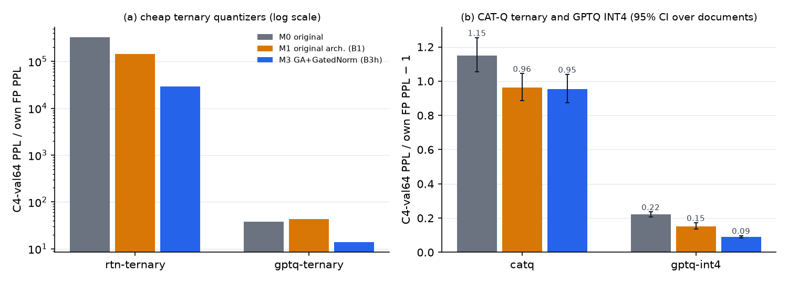
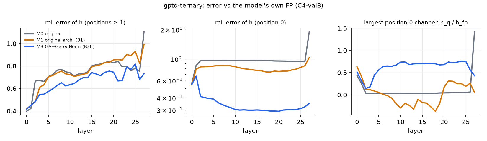
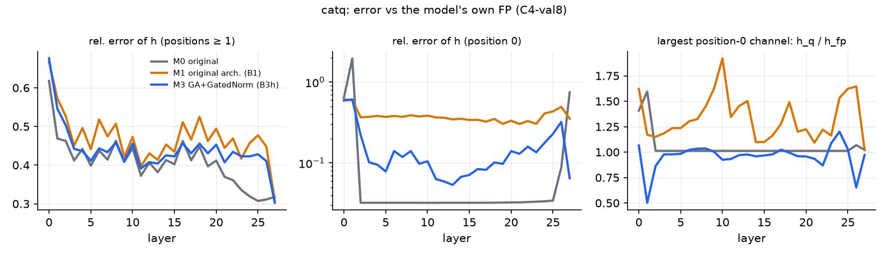
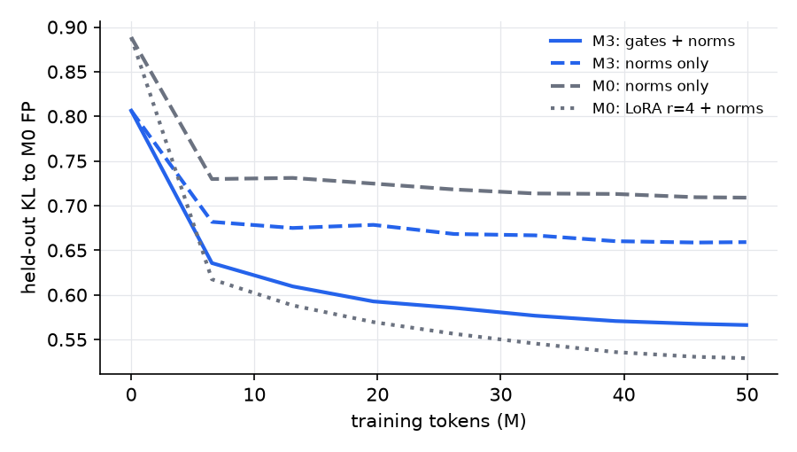

# Phase 3 レポート: 外れ値を後付けで抑えたモデルの PTQ（三値化）

- 作成: 2026-09-28 / 計画: [Phase 3 計画](../plans/20260927-ptq-ternary-plan.md)（§9 に決定事項）
- 関連: [Phase 2 最終レポート](./phase2-final.md)、CAT-Q 再現実装 [CAT-Q-Reproduction](https://github.com/takuma104/CAT-Q-Reproduction)（submodule `third_party/CAT-Q-Reproduction`）
- 生データ: `results/phase3/<run>/{quantized.pt, quant_log.json, eval/, diagnose/}`、`results/phase3/recover/<run>/`
- 表と図: `scripts/phase3_summary.py`（`docs/reports/figs/phase3/`）

---

## 0. 要約

対象は Qwen3-0.6B-Base と、Phase 2 の後付けモデル 2 つ。

| ID | モデル | FP の C4-val64 PPL |
|---|---|---|
| M0 | 元モデル | 18.18 |
| M1 | 元の構造のまま外れ値を正則化（Phase 2 B1、λ = 3e-3） | 19.15 |
| M3 | GA＋GatedNorm を後付け（Phase 2 B3h、λ = 3e-3） | 18.63 |

量子化したのは decoder の 7 種の Linear（グループサイズ 128）。埋め込み・Norm・後付けのゲートは bf16 のまま。

| 量子化器 | M0 | M1 | M3 | M3 / M0（95% 区間） |
|---|---|---|---|---|
| RTN 三値 | 596 万 | 276 万 | 54 万 | （全モデル崩壊） |
| GPTQ 三値 | 690 | 826 | **259** | **0.376** [0.325, 0.426] |
| **CAT-Q 三値**（W1.58A16） | 39.10 | 37.61 | **36.37** | **0.930** [0.920, 0.940] |
| GPTQ INT4（参照） | 22.18 | 22.07 | **20.32** | 0.916 [0.909, 0.923] |

表の値は C4-val64 PPL。M3 / M0 の区間は、評価文書 64 本の paired bootstrap による。

1. **三値化しやすさの差は、量子化器が弱いほど大きい。**
   - GPTQ 三値では、M3 の PPL は M0 の約 1/2.7 だった。
   - CAT-Q 三値では、差は 7%（自分の FP からの劣化で比べると 9%）に縮んだ。
   - M3 はどの量子化器でも最良で、主仮説 H5a は成り立つ。CAT-Q での差は seed を変えても再現した（2 seed の平均で 0.930 [0.923, 0.936]、seed 間のばらつきは 0.2〜0.4%）。
   - ただし、計画の目安「CAT-Q で FP からの劣化が 2 割以上改善」には届かなかった。
2. **M0 が GPTQ 三値で崩れるのは、スーパーウェイトが三値の格子で潰れて MA が崩壊するため。ただし、それだけでは M3 との差を説明できない。**
   - L2 の down_proj[35, 55] = 0.578（24σ）は、グループのスケール α = 0.159 に丸められる。その結果、先頭トークンの MA が 7200 から 1176 に崩れる。
   - M0 で \|w\| > 16σ の重み 505 個（全体の 0.0001%）を bf16 のまま残しても、690 が 513 に下がるだけだった（M3 は 259）。
   - M3 にもスーパーウェイトは残っている。ただし入力がほぼ来ない（先頭トークンの入力が 3456 → 48）ため、実質的に休眠している。
3. **CAT-Q（現行設定）は、M0 の MA とスーパーウェイトを自力で守る。**
   - MA の振幅は FP の 1.01 倍で、CAT-Q の再現実験で報告していた「回帰希釈」（v3、勾配クリッピングなし）は起きない。
   - M0 に残る固有の問題は、最終層で MA を打ち消すときに誤差が増えること。先頭トークンの最終層の相対誤差は M0 0.70〜0.75、M3 0.065 で、M0 の位置 0 の top-1 一致は 0〜1/8（2 seed）。
   - 影響は位置 0 だけなので、PPL への寄与は小さい。
4. **CAT-Q では、差の原因は「MA を消したこと」で、ゲートそのものではない。**
   - FP からの劣化で比べると、M3 と M1 は同等（比 0.994 [0.985, 1.006]）。
   - M3 が絶対値で最良なのは、FP 時点で M1 より良いから。
   - 一方、GPTQ 三値では M3 / M1 = 0.31 で、ゲートの有無が決定的だった。GPTQ 三値では M1 は M0 と同等かやや悪く、H5b は GPTQ 三値でだけ部分的に成り立つ。
5. **低ビットの活性と組み合わせると、差は大きく開く（H6 は成立）。** CAT-Q 三値の後に活性を per-token INT4 にすると、次のようになる。
   - M0: 完全に崩壊（+2.2×10⁶%）
   - M1: +2947%
   - M3: +1633%
   - NVFP4 では M0 +11.4%、M1 +8.4%、M3 +7.7%。
6. **ゲートによる回復は、LoRA に及ばない（H7 は不成立）。**
   - 三値の重みを固定し、ゲートと Norm（2.39M）だけを KL 蒸留で再学習すると、M3 の劣化の 30% が戻る（C4-val64 36.4 → 31.0）。
   - 同程度のパラメータ数の LoRA（M0、2.59M）は 42% を戻し、回復後の PPL も 2% 良い。
   - 回復の大半は Norm の重みだけ（0.07M）で得られる（19〜23%）。
   - ゲートの利点は、三値の重みを崩さないことと、活性の量子化への強さが残ること。A4-INT で M3 は +1362%、M0＋LoRA は +16 万%。
7. **P0 の再現確認**: 評価手順は CAT-Q の再現実験と一致した。
   - 当時の v3 モデルを本リポジトリの評価器で測ると C4-val8 PPL 87.55（報告値 87.6）、FP は 21.96（報告値 21.97）。
   - 同じ呼び出し経路と現行の既定値（`grad_clip = 0.5`）で post-trained 版を三値化すると 46.3 になり、v3 の約半分だった。

**P4（1.7B）への示唆**:
- W1.58A16 の CAT-Q では、M3 の優位は 7% と小さい。0.6B の MC では約 1 ポイントの差だった。1.7B でこの差を確かめるには約 50 GPU 時間かかり、見合わない可能性が高い。
- 差が桁違いに大きいのは活性の低ビット化（A4）のほう。1.7B に進むなら、W1.58A8 / A4 を主な条件に含めるのがよい（§7）。

---

## 1. 実験の全体像

- **量子化の対象**: decoder の q/k/v/o/gate/up/down（196 Linear、440M 重み）。グループサイズ 128。
  - bf16 のまま残すもの: 埋め込み（lm_head と共有）、Norm、後付けのゲート（M3 で 2.33M、全体の 0.4%）。
  - 実効ビット数: 量子化する重みは 1.58 bit＋グループのスケール（bf16/128 = 0.125 bit）。全パラメータで平均すると約 5.3 bit（0.6B では埋め込みが 26% を占める）。
- **量子化器**
  - **RTN 三値**: TWN 型。閾値 Δ = 0.7·mean\|w\|、スケール α は \|w\| > Δ の平均。
  - **GPTQ 三値 / INT4**: 自前実装。ブロックサイズはグループサイズと同じで、各グループの格子パラメータはそのグループに到達した時点の（誤差更新後の）重みで決める。キャリブレーションは C4 の 128×2048。
  - **CAT-Q 三値**: CAT-Q 再現実装の現行の既定値。SliderQuant の窓（4 層、stride 2）、LoRA r = 4、60 エポック、C4 の 512×2048、`grad_clip = 0.5`。0.6B で 1 本 101〜107 分（post-trained 版は 116 分）。
- **評価**
  - PPL: WikiText-2、C4-val8（CAT-Q の再現実験と同じ手順: C4 validation shard 0 で 1024 token 以上ある先頭 8 文書を、先頭 1024 token で切る）、C4-val64（同じ手順で 64 文書）。
  - held-out KL: M0 の FP に対する KL（FineWeb-Edu の別シャード、64×2048）。
  - lm-eval: CAT-Q 論文のプロトコル（PIQA / ARC / HellaSwag は acc_norm、WinoGrande は acc）＋LAMBADA。
  - 事後の活性 RTN（A8 = per-token INT8、A4 = NVFP4、A4-INT = per-token INT4）。WikiText-2 PPL の、重みを量子化したモデル自身からの増分。
  - Phase 1 の外れ値指標と attention sink。
- **診断（H5c）**: `scripts/ptq_diagnose.py`。量子化モデルと自分の FP を C4-val8 で並べて流し、層ごとに次を測る。
  - 残差ストリームの相対誤差（位置 0 と、位置 1 以降に分けて）
  - RMSNorm 後の相対誤差
  - 位置 0 で最大のチャネルの振幅比
  - 最終出力の top-1 一致率
- **不確かさ**: C4-val64 の文書ごとの NLL を保存し（`scripts/ptq_docnll.py`）、同じ文書での差を 1 万回 bootstrap した。量子化の実行ごとのばらつきは、CAT-Q の seed を変えた反復で見た（§4.5）。
- **計画からの変更**
  - GPTQ 三値で M0 の崩れ方がスーパーウェイトで説明できそうだったため、外れ値の重みを bf16 で残す対照（`--keep-sigma`）を追加した。
  - 評価文書の paired bootstrap と、CAT-Q の seed 反復を追加した。
  - W4 の参照は GPTQ INT4 のみにした（NVFP4 の重み量子化は省略）。
  - 実施しなかった A4 の副条件: down_proj の入力だけ 8bit に残す構成、online Hadamard。
  - 実施しなかった P2 の余力分: 活性を考慮した CAT-Q、ゲートも 8bit にする条件。

---

## 2. P0: 統合と再現確認

- **CAT-Q と GA の両立**: CAT-Q は o_proj を 2 回差し替える（CATQLinear への置き換えと、焼き込み時の新しい `nn.Linear`）。GA のゲートは o_proj に付けたフックで掛けているので、差し替えると黙って外れる。
  - `RetrofitCATQ`（`src/outliers/ptq.py`）で、差し替えのたびにフックを付け直すようにした。
  - CAT-Q の fp モードの出力が、後付けモデルとビット一致することをテストで確かめた。
- **state_dict のバグ**: 付け直し先の o_proj を保持する属性が `nn.Module.__setattr__` 経由でサブモジュールとして登録され、state_dict に o_proj が二重に入っていた。そのため Phase 2 のチェックポイントを strict モードで読めなかった。通常の属性に直し、「後付けで増える state_dict のキーは新しいパラメータだけ」というテストを足した。
- **再現確認（R0）**: post-trained 版の Qwen3-0.6B を、本リポジトリの呼び出し経路で CAT-Q 三値化した。

| | C4-val8 PPL | 備考 |
|---|---|---|
| FP（CAT-Q の再現実験の報告値 / 本リポジトリで測った値） | 21.97 / 21.96 | |
| CAT-Q v3 のモデル（報告値 / 本リポジトリの評価器で測った値） | 87.6 / 87.55 | `grad_clip = None` |
| **R0: 本リポジトリの経路＋現行の既定値** | **46.3** | `grad_clip = 0.5`。窓の最終損失の合計は v3 より 27% 低い（247 vs 337） |

評価手順は完全に一致している。PPL の差は、v3 のレポートの後に既定値になった勾配クリッピング（`grad_clip = 0.5`）による。v3 は `None` だった。キャリブレーションデータ（CAT-Q の再現実験のキャッシュ）は同一で、GA を持たないモデルでは `RetrofitCATQ` は元の実装と同じ動作になる。この値は CAT-Q の再現実装の側の結果（0.6B で 87.6）を更新するものなので、あちらのレポートにも追記した。

---

## 3. P1: RTN / GPTQ



(b) の誤差棒は、モデルごと（量子化モデルと自分の FP の paired）の 95% 区間。モデル間の比較は §4.3 の paired の区間を見る。

| 方式 | モデル | WikiText-2 | C4-val8 | C4-val64 | ×自分の FP | held-out KL | top-1 一致 | MA（先頭） |
|---|---|---|---|---|---|---|---|---|
| FP | M0 | 12.67 | 15.29 | 18.18 | – | 0.000 | – | 7200 |
| FP | M1 | 13.63 | 16.07 | 19.15 | – | 0.053 | – | 1696 |
| FP | M3 | 13.22 | 15.66 | 18.63 | – | 0.029 | – | 248 |
| RTN 三値 | M0 | 9,075,120 | 6,313,878 | 5,961,007 | 3.3×10⁵ | 13.57 | 0.000 | 876 |
| RTN 三値 | M1 | 4,300,388 | 2,414,804 | 2,757,023 | 1.4×10⁵ | 12.33 | 0.000 | 660 |
| RTN 三値 | M3 | 766,209 | 497,571 | 543,368 | 2.9×10⁴ | 10.81 | 0.001 | 142 |
| GPTQ 三値 | M0 | 1,378 | 532.5 | 690.1 | 37.96 | 3.896 | 0.216 | 1176 |
| GPTQ 三値 | M1 | 1,209 | 757.1 | 826.0 | 43.12 | 3.910 | 0.181 | 308 |
| GPTQ 三値 | **M3** | **471.3** | **214.0** | **259.3** | **13.92** | **2.842** | **0.295** | 172 |
| GPTQ 三値＋外れ重みを保持（>16σ、505 個） | M0 | 1,126 | 418.5 | 513.5 | 28.25 | 3.581 | 0.226 | 3504 |
| GPTQ 三値＋外れ重みを保持（>12σ、1893 個） | M0 | 1,154 | 442.1 | 549.4 | 30.22 | 3.645 | 0.224 | 3520 |
| GPTQ 三値＋外れ重みを保持（>16σ、500 個） | M3 | 430.6 | 199.3 | 246.5 | 13.23 | 2.763 | 0.297 | 168 |
| GPTQ INT4 | M0 | 15.79 | 18.31 | 22.18 | 1.22 | 0.203 | 0.775 | 7168 |
| GPTQ INT4 | M1 | 16.17 | 18.21 | 22.07 | 1.15 | 0.206 | 0.806 | 1408 |
| GPTQ INT4 | **M3** | **14.79** | **16.92** | **20.32** | **1.09** | **0.125** | **0.841** | 228 |

top-1 一致は、自分の FP に対する C4-val8 の値。

- **RTN 三値は全モデルで崩壊する**（相対誤差 0.44、0 の割合 43%）。M3 の崩壊が 1 桁小さいだけ。
- **GPTQ 三値では M3 だけが大きく良い。**
  - M1 は M0 と同等かやや悪い（C4-val64 の比 1.20 [1.04, 1.37]、FP からの劣化の比 1.14 [0.99, 1.30]）。
  - 元の構造のまま外れ値を抑えると、Attention の重みが量子化に 2〜5 倍敏感になっていた（Phase 2 §3.3）。これが三値でもそのまま効いている。
- **スーパーウェイトの三値化**:
  - M0 の L2 down_proj の行 35 には 0.578（24σ）の重みが 2 つある（列 46 と 55）。三値の格子では、グループのスケール α = 0.159（元の 27%）に丸められる。INT4 は absmax でスケールを決めるので正確に残る。
  - その結果、MA は GPTQ 三値で 7200 → 1176、RTN 三値で → 876 になり、attention sink の比率も 0.75 → 0.15 に落ちる。
- **外れ重みを残す対照**:
  - \|w\| > 16σ の 505 個を bf16 で残すと、M0 の MA は 3504 まで戻り、PPL は 690 → 513 になる。ただし M3（259）との差は約 2 倍残る。
  - sink の比率はかえって 0.036 に下がる。MA だけ戻っても、それを前提にした Attention 側（q・k）が三値化で崩れているためと考えられる（未検証）。
  - 重みの外れ値そのものは M0 と M3 でほぼ同じ（>16σ で 505 個 vs 500 個）。後付けの学習は元の重みをほとんど動かしていない。
- **M3 のスーパーウェイトは休眠している。** 重みは 0.570 と残っている。しかし L2 down_proj の列 55 への先頭トークンの入力が 3456 → 48 に下がっていて、この重みはもう MA を作っていない。量子化で潰れても害が小さい。
- **先頭トークンの予測は、M0 では INT4 でも壊れる。**
  - 最終層（L27）で、M0 は MA を打ち消している。MA の振幅に比べてわずかな相対誤差でも、打ち消した後には大きな絶対誤差として残る。
  - 位置 0 の最終層の相対誤差は M0 2.73、M1 0.46、M3 0.078。top-1 一致は M0 0/8、M3 6/8。
  - 位置 0 の予測は PPL の 1/1024 にしか効かないが、壊れ方の仕組みとして明確。



---

## 4. P2: CAT-Q 三値（W1.58A16）

### 4.1 主結果

| モデル | WikiText-2 | C4-val8 | C4-val64 | ×自分の FP | held-out KL | 自分の FP との KL | top-1 一致 | MA（先頭） | sink ratio |
|---|---|---|---|---|---|---|---|---|---|
| M0 | 40.75 | 31.93 | 39.10 | 2.15 | 0.908 | 0.751 | 0.592 | 7008 | 0.62 |
| M1 | 38.91 | 30.41 | 37.61 | 1.96 | 0.847 | 0.655 | 0.608 | 1760 | 0.51 |
| **M3** | **36.38** | **29.64** | **36.37** | **1.95** | **0.823** | 0.658 | **0.615** | 204 | 0.47 |

### 4.2 lm-eval（CAT-Q 論文のプロトコル）

| 方式 | モデル | PIQA | ARC-e | ARC-c | HellaSwag | WinoGrande | **5 タスク平均** | LAMBADA |
|---|---|---|---|---|---|---|---|---|
| FP | M0 | 69.9 | 58.1 | 38.2 | 53.7 | 58.6 | **55.7** | 53.7 |
| FP | M1 | 69.0 | 64.5 | 38.7 | 51.8 | 56.7 | **56.1** | 50.1 |
| FP | M3 | 69.5 | 64.6 | 38.0 | 52.7 | 57.5 | **56.5** | 52.8 |
| CAT-Q | M0 | 61.6 | 42.0 | 24.4 | 33.5 | 52.2 | **42.8** | 14.9 |
| CAT-Q | M1 | 61.1 | 43.4 | 24.6 | 33.7 | 53.0 | **43.2** | 14.3 |
| CAT-Q | M3 | 61.4 | 44.0 | 26.4 | 34.6 | 52.6 | **43.8** | **18.5** |

- 5 タスク平均の偶然水準は約 35。0.6B の三値モデルでは MC 精度が低く、差は 1 ポイント程度で頭打ちになっている。
- M1 と M3 の ARC-e は FP の時点で +6 ポイント高い（Phase 2 の FineWeb-Edu 学習による共通の変化）。5 タスク平均の差の一部はこの分。
- **LAMBADA だけは、M3 が明確に良い（18.5 vs 14.9 / 14.3）。** seed を変えても同じ傾向（§4.5）。

### 4.3 モデル間の比較（評価文書の paired bootstrap）

| 方式 | 比較 | C4-val64 PPL の比 [95% 区間] | 自分の FP からの劣化の比 [95% 区間] |
|---|---|---|---|
| GPTQ 三値 | M3 / M0 | 0.376 [0.325, 0.426] | 0.367 [0.317, 0.415] |
| GPTQ 三値 | M1 / M0 | 1.197 [1.043, 1.373] | 1.136 [0.990, 1.303] |
| GPTQ 三値 | M3 / M1 | 0.314 [0.282, 0.344] | 0.323 [0.289, 0.354] |
| **CAT-Q 三値** | **M3 / M0** | **0.930 [0.920, 0.940]** | **0.908 [0.897, 0.918]** |
| CAT-Q 三値 | M1 / M0 | 0.962 [0.951, 0.972] | 0.913 [0.901, 0.924] |
| CAT-Q 三値 | M3 / M1 | 0.967 [0.958, 0.976] | 0.994 [0.985, 1.006] |
| GPTQ INT4 | M3 / M0 | 0.916 [0.909, 0.923] | 0.894 [0.886, 0.901] |
| GPTQ INT4 | M1 / M0 | 0.995 [0.983, 1.010] | 0.944 [0.934, 0.956] |
| GPTQ INT4 | M3 / M1 | 0.921 [0.905, 0.933] | 0.947 [0.933, 0.957] |

「自分の FP からの劣化の比」は、(量子化 PPL / 自分の FP PPL) をモデル間で比べたもの。この区間は評価文書のばらつきだけを反映していて、量子化の実行ごとのばらつきは §4.5 で見る。

- CAT-Q では、M1 も M3 も M0 より劣化が約 9% 小さい。M1 と M3 の間に差はない。**CAT-Q では、効いているのは外れ値（MA）を減らしたことで、ゲートの有無ではないと読める。**
- GPTQ（三値、INT4 とも）では、M3 が M1 より明確に良い。LoRA と学習するスケールを持たない量子化器では、M1 の Attention の重みの敏感さがそのまま出る。

### 4.4 誤差の構造（H5c）



- **回帰希釈は起きない。** CAT-Q の再現実験（v3、クリッピングなし）では、窓出力の MSE 最小化が MA の振幅を系統的に縮め、RMSNorm がそれを方向誤差として増幅していた。現行設定では、M0 の MA 振幅は FP の 1.01 倍で、Norm 後の誤差は Norm 前の 1.02 倍にとどまる。
- **M0 の誤差は、最終層の位置 0 に集中する。** L2〜L25 の位置 0 の相対誤差は 0.03 と小さい（MA が方向をほぼ決めているため）。L27 で MA を打ち消すと 0.75 に跳ね上がる。M3 は 0.065、M1 は 0.35。
- **位置 1 以降の誤差は 3 モデルとも同程度**（最終層で 0.30〜0.32）。
  - 中盤〜終盤（L20〜L26）では、M0 のほうがむしろ低い（平均 0.35 vs M1 0.46、M3 0.43）。
  - CAT-Q の窓の損失（MSE の合計）は M0 284、M1 374、M3 419 と M0 が最も低い。ただし残差ストリームの尺度がモデルごとに違うので、この数値をモデル間で直接比べることはできない。

### 4.5 実行ごとのばらつき（seed 反復）

CAT-Q の seed（バッチ順と LoRA の初期化）を変えて、M0 と M3 をもう 1 本ずつ量子化した。

| モデル | seed | WikiText-2 | C4-val64 | held-out KL | 自分の FP との KL | 5 タスク平均 | LAMBADA | 位置 0 の最終層の誤差 | A4-INT |
|---|---|---|---|---|---|---|---|---|---|
| M0 | 0 | 40.75 | 39.10 | 0.908 | 0.751 | 42.8 | 14.9 | 0.748 | 崩壊 |
| M0 | 1 | 39.69 | 39.00 | 0.896 | 0.730 | 42.0 | 16.1 | 0.703 | 崩壊 |
| M3 | 0 | 36.38 | 36.37 | 0.823 | 0.658 | 43.8 | 18.5 | 0.065 | +1633% |
| M3 | 1 | 37.08 | 36.24 | 0.802 | 0.648 | 43.7 | 18.2 | 0.065 | +1269% |

| 比較（C4-val64） | PPL の比 [95% 区間] | 自分の FP からの劣化の比 |
|---|---|---|
| 同じモデルの seed 間（M0: s1 / s0） | 0.998 [0.986, 1.009] | – |
| 同じモデルの seed 間（M3: s1 / s0） | 0.996 [0.989, 1.004] | – |
| M3 / M0（seed 0） | 0.930 [0.920, 0.940] | 0.908 [0.897, 0.918] |
| M3 / M0（seed 1） | 0.929 [0.920, 0.938] | 0.907 [0.897, 0.916] |
| **M3 / M0（2 seed の平均）** | **0.930 [0.923, 0.936]** | **0.907 [0.900, 0.915]** |

- 実行ごとのばらつき（C4-val64 で 0.2〜0.4%）は、M3 と M0 の差（7%）より 1 桁以上小さい。**CAT-Q での M3 の優位は seed によらず再現する。**
- WikiText-2 は seed 間で ±2% 動き、M3 / M0 の比は 0.893 と 0.934 だった。C4-val64 より粗い指標として扱う。
- 5 タスク平均の差は +1.0 / +1.7 ポイント、LAMBADA の差は +3.6 / +2.1 ポイントで、どちらも M3 が上。

### 4.6 活性の低ビット化との組み合わせ（H6）

WikiText-2 PPL の、重みを量子化したモデル自身からの増分。

| 方式 | モデル | A8 | A4（NVFP4） | A4-INT（per-token INT4） |
|---|---|---|---|---|
| FP | M0 / M1 / M3 | +2.5% / +2.1% / +1.4% | +9.5% / +20.2% / +10.5% | +95015% / +30377% / +4020% |
| CAT-Q 三値 | M0 | +2.7% | +11.4% | **+2161759%（崩壊）** |
| CAT-Q 三値 | M1 | +1.6% | +8.4% | +2947% |
| CAT-Q 三値 | **M3** | **+1.3%** | **+7.7%** | **+1633%** |
| GPTQ INT4 | M0 / M1 / M3 | +3.7% / +2.8% / +1.8% | +12.6% / +26.0% / +12.8% | +125613% / +49058% / +5360% |

- W1.58A8 では、3 モデルとも A16 からの劣化は 3% 以内（H6 の予想どおり）。
- **per-token INT4 では、M0 は重みの量子化の有無にかかわらず崩壊する。** 先頭トークンの MA（7200）と step-up ブロックの gate_up 入力が原因（Phase 2 §3.3）。M3 は 1,300 倍小さいが、それでも実用水準ではない。down_proj 入力への外れ値の移動（Phase 2 §3.4）が残っている。
- NVFP4 では M3 が最良（+7.7%）。M1 は FP では +20.2% と弱かったが、CAT-Q の後は +8.4% に改善した。理由は確かめていない（LoRA による再構成で活性の分布が変わった可能性がある）。

---

## 5. P3: ゲートによる回復（H7）

- **設定**
  - P2 の CAT-Q 三値モデルで、三値の重みは固定したまま、一部の bf16 パラメータだけを M0 の FP への KL 蒸留で学習した（`scripts/ptq_recover.py`）。
  - データは FineWeb-Edu 50M token（32×2048 を 763 step）。AdamW、warmup 3%、cosine で 0.1 倍まで下げる。1 本約 70 分。
- **学習率の選び方**
  - 5M token の短い学習で {3e-4, 1e-3, 3e-3} を比べ、最良が上端なら 1e-2、3e-2 と広げた。
  - 決めた値: gates は 1e-3（範囲の内側）、LoRA は 3e-3（1e-2 は発散）、norms は 3e-2。norms は上端のままだが、1e-2 → 3e-2 の改善は小さく頭打ちに近い（KL 0.727 → 0.719）。
- **学習するもの**
  - gates: GatedNorm と GA のゲート＋すべての RMSNorm の重み
  - norms: RMSNorm の重みだけ
  - LoRA: 7 種の Linear に r = 4 の LoRA＋RMSNorm の重み。パラメータ数を gates にそろえた対照で、評価時は重みに統合する。統合した重みはもう三値ではない。



図の曲線は学習中の held-out KL（16 本）で、表の値（64 本）とは少しずれる。

| 元の三値モデル | 学習するもの | パラメータ数 | LR | held-out KL（前 → 後） | C4-val64 PPL（前 → 後） | 回復率 | 5 タスク平均 | LAMBADA |
|---|---|---|---|---|---|---|---|---|
| M3 | gates＋norms | 2.39M | 1e-3 | 0.823 → 0.584 | 36.37 → 30.98 | 30% | 45.0 | **32.9** |
| M3 | norms のみ | 0.07M | 3e-2 | 0.823 → 0.672 | 36.37 → 32.98 | 19% | 44.0 | 32.1 |
| M0 | norms のみ | 0.07M | 3e-2 | 0.908 → 0.725 | 39.10 → 34.25 | 23% | 43.7 | 28.8 |
| M0 | LoRA r = 4＋norms | 2.59M | 3e-3 | 0.908 → **0.548** | 39.10 → **30.35** | **42%** | **45.6** | 31.9 |

回復率 = (三値化後の PPL − 回復後の PPL) / (三値化後の PPL − 自分の FP の PPL)。C4-val64 で計算した。

| 比較（回復後） | C4-val64 PPL の比 [95% 区間] |
|---|---|
| M3 gates / M0 LoRA | 1.021 [1.013, 1.029] |
| M3 gates / M3 norms | 0.939 [0.933, 0.945] |
| M0 LoRA / M0 norms | 0.886 [0.876, 0.896] |
| M3 norms / M0 norms | 0.963 [0.956, 0.970] |

回復後の、活性の事後 RTN（WikiText-2 PPL の増分）:

| 回復後のモデル | A8 | A4（NVFP4） | A4-INT | MA（先頭） |
|---|---|---|---|---|
| M3 gates＋norms | +1.1% | +7.9% | **+1362%** | 360 |
| M3 norms のみ | +0.9% | +7.6% | +1509% | 221 |
| M0 norms のみ | +3.2% | +9.7% | +477671% | 7744 |
| M0 LoRA＋norms | +3.5% | +9.7% | +164824% | 7392 |

- **回復の大半は Norm の重み（6.6 万パラメータ）だけで得られる。** 劣化の 19〜23% が戻る。
- **ゲートの上乗せは、LoRA の上乗せより小さい。** 同程度のパラメータ数（約 2.3〜2.5M）を足したとき、norms のみからの改善は M3 のゲートが 6%、M0 の LoRA が 11%。最終的な PPL も M0＋LoRA が 2% 良い。**「ゲートは同じパラメータ数の LoRA より効率が良い」は成り立たない。**
- ただし配置の条件は同じではない。
  - LoRA は、重みに統合すると三値の格子が崩れる。統合しなければ、層ごとに 7 つの低ランク matmul が残る。
  - ゲートは元からモデルの構造の一部なので、三値の重みはそのまま残る。推論コストは Phase 2 §3.6 のとおり、融合なしで prefill +7.6%、decode +34%。
- **LAMBADA は、どの回復でも大きく戻る**（14〜19 → 29〜33）。M3＋gates が最も高い。
- **回復の後も、活性の量子化への強さは M3 に残る。** A4-INT で M3 は +1362%、M0 は +16 万〜48 万%。M0 の MA（7392〜7744）は回復学習では消えない。

---

## 6. 仮説の判定

| 仮説 | 判定 | 根拠 |
|---|---|---|
| **H5a**: M3 は三値化後の劣化が M0 より小さい | **成立（量子化器しだいで大きさが変わる）** | GPTQ 三値 0.37 倍、CAT-Q 0.91 倍（FP からの劣化の比）。CAT-Q での目安「2 割以上」には届かない |
| **H5b**: M1 は M0 より悪化する | **GPTQ 三値でのみ部分的に成立** | GPTQ 三値 1.14 [0.99, 1.30]。CAT-Q と INT4 では M1 のほうが良い（0.91 / 0.94） |
| **H5c**: M0 の誤差は MA の層に集中し、M3 では消える | **形を変えて成立** | GPTQ ではスーパーウェイトの丸めで MA が崩壊する（L2）。CAT-Q では MA は保たれ、誤差は最終層の位置 0 に集中する（M0 0.75 vs M3 0.065） |
| **H6**: A4 で M3 の優位が広がる | **成立** | CAT-Q の後の per-token INT4 は M0 が崩壊、M3 は +1633%。NVFP4 では +11.4% vs +7.7% |
| **H7**: ゲートだけの再学習で劣化の半分以上を回復でき、同じパラメータ数の LoRA より効率が良い | **不成立** | 回復率 30%（norms のみでも 19%）。M0＋LoRA r = 4 は 42% で、回復後の PPL も 2% 良い（1.021 [1.013, 1.029]） |

---

## 7. 考察と次の一手

### 7.1 後付けが PTQ に効く場所

- **量子化器が MA の仕組みを守れないとき、後付けの効果は大きい。**
  - GPTQ 三値では、スーパーウェイトが格子で潰れて MA が崩れ、M0 は M3 の 2.7 倍の PPL になる。
  - CAT-Q は、学習するスケールと LoRA で MA を自力で守るので、差は 7% まで縮む。
  - 後付けのモデルは、スーパーウェイトを休眠させ、MA とその打ち消し（L27）をなくしている。量子化器が守るべきものが初めからない。
- **ゲートそのもの（M1 との差）が効くのは、再構成の自由度が低いとき。**
  - GPTQ 三値では M3 / M1 = 0.31、GPTQ INT4 では 0.92。
  - CAT-Q では、FP からの劣化は M1 と M3 で同等（0.994）だった。LoRA とスケールの学習が、M1 の Attention の重みの敏感さを吸収していると考えられる。
- **最も差が大きいのは、活性の量子化。**
  - CAT-Q 三値＋per-token INT4 では、M0 は崩壊し、M3 は +1633%。P3 の回復後も +1362% vs +16 万% と差が残る。
  - ただし M3 でも実用水準ではない。Phase 2 §3.4 の終盤層の down_proj 入力（MLP 中間活性の外れ値）が次のボトルネック。
- **ゲートを回復用のパラメータとして使う案（H7）は、LoRA より弱かった。** 回復の大半は Norm の重みだけで得られる。ゲートの価値は、回復用の自由度ではなく、外れ値を作らない構造であることにある。

### 7.2 次の一手（提案）

1. **P4（1.7B）は、計画どおりの W1.58A16 だけなら見送りを提案する。**
   - 0.6B では 7% の PPL 差が MC で約 1 ポイントに相当した。1.7B でも同程度の差にとどまる見込みで、約 50 GPU 時間に見合わない可能性が高い。
   - 実施するなら、W1.58A8 / A4 を主な条件に含める。
2. **0.6B で、活性を考慮した CAT-Q（再構成中に A8 / A4 を掛ける、計画 §3 の余力分）を先に行う。**
   - 重みの側では、CAT-Q が M3 の優位の大部分を吸収した。量子化器が活性にも適応した場合に、A4 での大きな差が残るかを確かめる（1 本約 2 時間）。
3. **MLP 中間活性（down_proj 入力）の外れ値を抑える。** Phase 2 の正則化を SwiGLU の出力にも広げる。A4 を実用水準にするための前提で、後回しにした W4A4 の比較（計画 §9-4）にもそのまま効く。

---

## 付録: 実行コマンド

```bash
SRC_M0=qwen3-0.6b; SRC_M1=results/phase2/c2/B1-lam3e-3/final.pt; SRC_M3=results/phase2/c2/B3h-lam3e-3/final.pt
FAST="--no-lm-eval --rtn-schemes A8 A4 A4-INT --no-rtn-per-kind --attention"

# FP の基準（Phase 3 の指標つき）
uv run python scripts/eval_retrofit.py --base qwen3-0.6b --out results/phase3/fp-M0/eval $FAST
uv run python scripts/eval_retrofit.py --ckpt $SRC_M1 --out results/phase3/fp-M1/eval $FAST
uv run python scripts/eval_retrofit.py --ckpt $SRC_M3 --out results/phase3/fp-M3/eval $FAST

# P1: RTN / GPTQ（M1・M3 も同様。外れ重みの対照は --keep-sigma 16 / 12）
uv run python scripts/ptq_quantize.py --model $SRC_M0 --method gptq-ternary --name M0-gptq-ternary
uv run python scripts/ptq_quantize.py --model $SRC_M0 --method gptq-ternary --keep-sigma 16 --name M0-gptq-ternary-keep16
uv run python scripts/eval_retrofit.py --ckpt results/phase3/M0-gptq-ternary/quantized.pt $FAST

# P0 の再現確認（post-trained 版。held-out KL は Base 版のデータで測る）
uv run python scripts/ptq_quantize.py --model qwen3-0.6b-instruct --method catq --name R0-catq
uv run python scripts/eval_retrofit.py --ckpt results/phase3/R0-catq/quantized.pt --no-lm-eval --rtn-schemes A8 \
  --no-rtn-per-kind --data-model qwen3-0.6b

# P2: CAT-Q（seed 反復は --seed 1 --name M0-catq-s1）
uv run python scripts/ptq_quantize.py --model $SRC_M3 --method catq --name M3-catq
uv run python scripts/eval_retrofit.py --ckpt results/phase3/M3-catq/quantized.pt --rtn-schemes A8 A4 A4-INT \
  --no-rtn-per-kind --attention

# 診断と、文書ごとの NLL（すべての量子化モデルと FP）
uv run python scripts/ptq_diagnose.py --ckpt results/phase3/M3-catq/quantized.pt
uv run python scripts/ptq_docnll.py results/phase3/*/quantized.pt --fp M0 M1 M3

# P3: 学習率の比較（5M token）→ 本番（50M token）→ 評価
uv run python scripts/ptq_recover.py --ckpt results/phase3/M3-catq/quantized.pt --train gates --run sweep-M3-catq-gates-lr1e-3 \
  --tokens 5e6 --lr 1e-3 --probe-every 25 --no-wandb
uv run python scripts/ptq_recover.py --ckpt results/phase3/M3-catq/quantized.pt --train gates --run M3-catq-gates --tokens 50e6 --lr 1e-3
uv run python scripts/ptq_recover.py --ckpt results/phase3/M3-catq/quantized.pt --train norms --run M3-catq-norms --tokens 50e6 --lr 3e-2
uv run python scripts/ptq_recover.py --ckpt results/phase3/M0-catq/quantized.pt --train norms --run M0-catq-norms --tokens 50e6 --lr 3e-2
uv run python scripts/ptq_recover.py --ckpt results/phase3/M0-catq/quantized.pt --train lora --run M0-catq-lora --tokens 50e6 --lr 3e-3
uv run python scripts/eval_retrofit.py --ckpt results/phase3/recover/M3-catq-gates/final.pt --out results/phase3/recover/M3-catq-gates/eval \
  --rtn-schemes A8 A4 A4-INT --no-rtn-per-kind --attention

# 表と図
uv run python scripts/phase3_summary.py
```
